# Lab 2 - Migrate Database from an On-Premises SQL Server to Azure SQL Database

### Time Duration – 60 mins

## Introduction

Modernizing on-premises databases by migrating them to the cloud is a
critical step in adopting Azure's fully managed platform and improving
scalability, security, and maintainability. In this lab, you will
perform an end-to-end migration of a SQL Server database hosted on a
Windows Virtual Machine to **Azure SQL Database**.

## Objective

The objective of this lab is to guide the learners through the
end-to-end process of migrating a SQL Server database hosted on a
Windows Virtual Machine to Azure SQL Database. By completing this lab,
participants will gain hands-on experience in provisioning a SQL Server
VM, preparing the AdventureWorks sample database, configuring the Azure
Database Migration Service (DMS), and executing an offline migration to
Azure SQL Database. This exercise demonstrates how to modernize
on-premises SQL workloads by leveraging Azure’s fully managed database
platform.

## Exercise 1 - Create an On-prem SQL Server

Companies have legacy databases which they would need to migrate to
Azure to modernize their applications. We need an On-prem database which
we can migrate to the Azure SQL Database. In this Exercise, you will
create an On-prem Database in Azure SQL Virtual Machine.

1.  Sign in to the **Azure portal** at +++https://portal.azure.com+++
    using the following cloud slice credentials.

    - Username: +++@lab.CloudPortalCredential(User1).Username+++

    - TAP Token - +++@lab.CloudPortalCredential(User1).AccessToken+++

    

    

    

2.  Search for and select +++**Azure SQL**+++.

    

3.  In the Overview page, find **SQL Server on Azure Virtual Machines**
    and select **Show options**.

    

4.  Choose **Free SQL Server License: SQL Server 2019 Developer on
    Windows Server 2022** image from the list.

    

    

5.  Select **Create virtual machine** to start creating the VM.

    

6.  In the Create a virtual machine, select **ResourceGroup1** from the
    **Resource group** dropdown.
    
    

7.  Enter the below details under the Instance details

    - Virtual Machine Name: Enter +++**SQLVM**+++

    - Region: Select **East US 2**

    - Availability options: Select **No infrastructure redundancy required**

    - Security type: Standard

    - Image: Select **Free SQL Server License: SQL Server 2019 Developer on
    Windows Server 2022**

    - Size: Select **Standard_D16ds_v4-16 vcpus, 64 GiB memory**

    

8.  Under **Administrator account**, enter the below details:

    - **Username:** Enter +++sqlserveradmin+++

    - **Password:** Enter +++sqlPwd981!2@98+++

    Select **Next:Disks**.

    

9.  Accept the defaults in other pages till the **SQL Server Settings**
    page. In the **SQL Server Settings** page,

    - **SQL Authentication:** Select **Enable**

    - **Login:** Enter +++sqlserveradmin+++

    - **Password:** Enter +++sqlPwd981!2@98+++

    

10. Select **Review + Create** to create the VM.

    

11. Click on **Create** once the validation succeeds.

    

12. Once the deployment is complete, select **Go to resource**. The
    deployment will take around 20 minutes to complete.

    

13. From the **Overview** page of the VM, look for the **Public IP** and
    **save** the **IP value** in a notepad. This value will be needed to
    **connect** to the **database** in the VM.

    

14. From the left pane of the VM, select **Network Settings** under
    **Networking**.

    Select **+ Create port rule** -\> **Inbound port rule**.

    

15. We will need to add an inbound port rule to allow TCP traffic from
    port 1433.

16. In the Add inbound security rule pane, select the below values and
    then select **Add**.

    - Source: Select **Any**

    - Source port ranges: \*

    - Destination: Select **Any**

    - Service: Select **Custom**

    - Destination port ranges: Enter +++**1433**+++

    - Protocol: Select **TCP**

    - Action: Select **Allow**

    - Name: Enter +++TCPRule++

    

    

17. From the VM’s Overview page, select the drop down next to
    **Connect** and select the **Connect** option.

    

18. In the **SQLVM|Connect** page, select the **Download RDP file**
    option to download the Remote Desktop Connection file.

    

    **Note:** If you get a pop-up, select **Keep**.

19. Double click the downloaded file to connect to the VM. Select
    **Connect** when prompted.

    

20. Select **Yes** and login using the following VM credentials.

    - Username: +++sqlserveradmin+++

    - Password: +++sqlPwd981!2@98+++

    

21. Select **Yes**.

    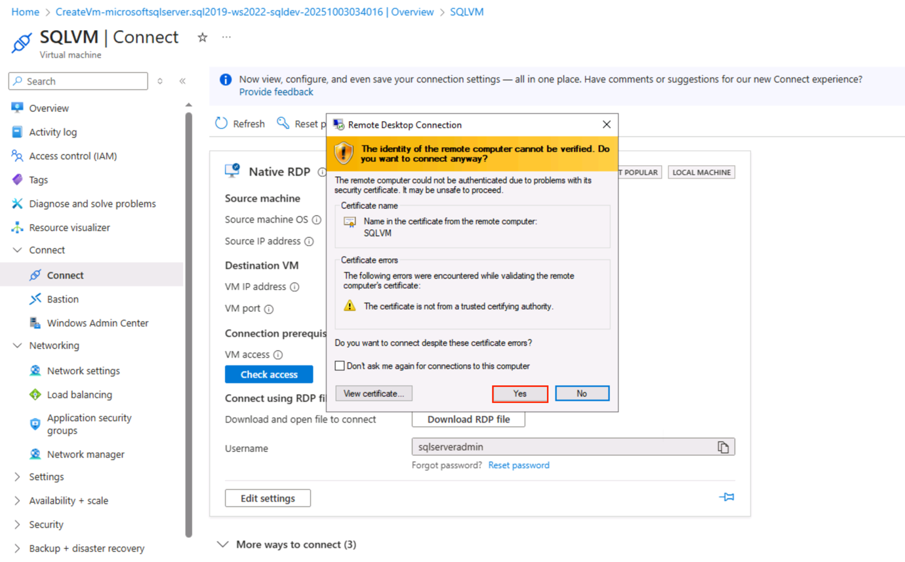

22. Once logged in, open web browser and select **Start without your
    data**.

    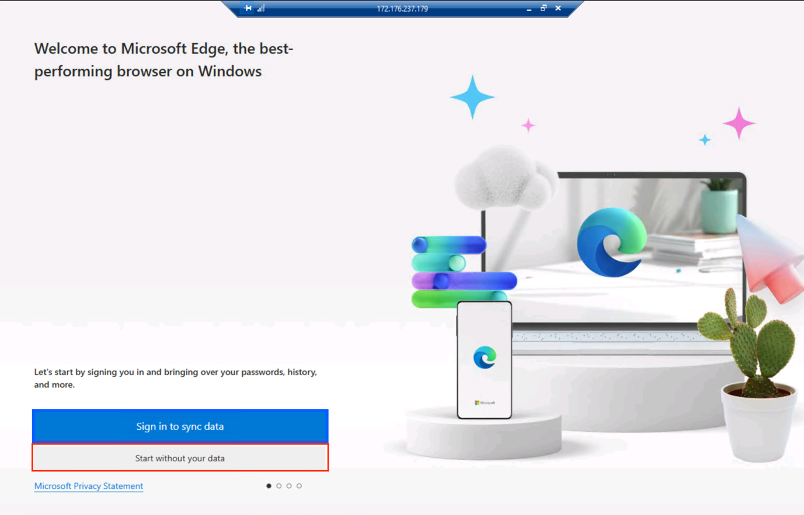

23. Click **Confirm and Continue**.

    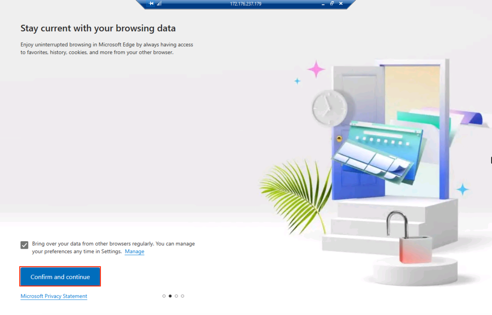

24. Click **Continue without Google Data**.

    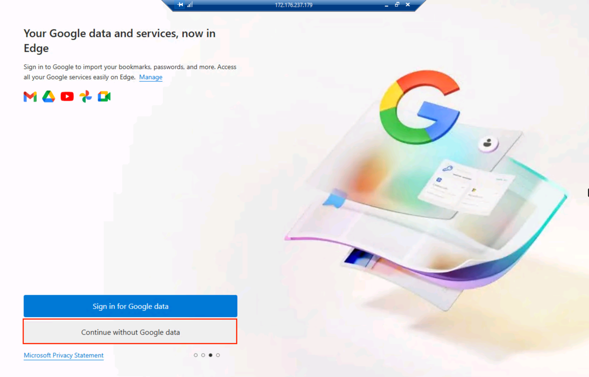

25. Click **Confirm and start browsing**.

    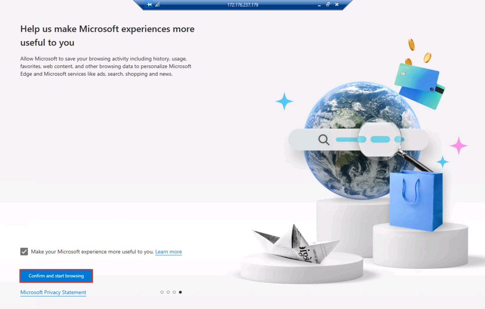

26. Open the link +++https://download-directory.github.io/+++.

    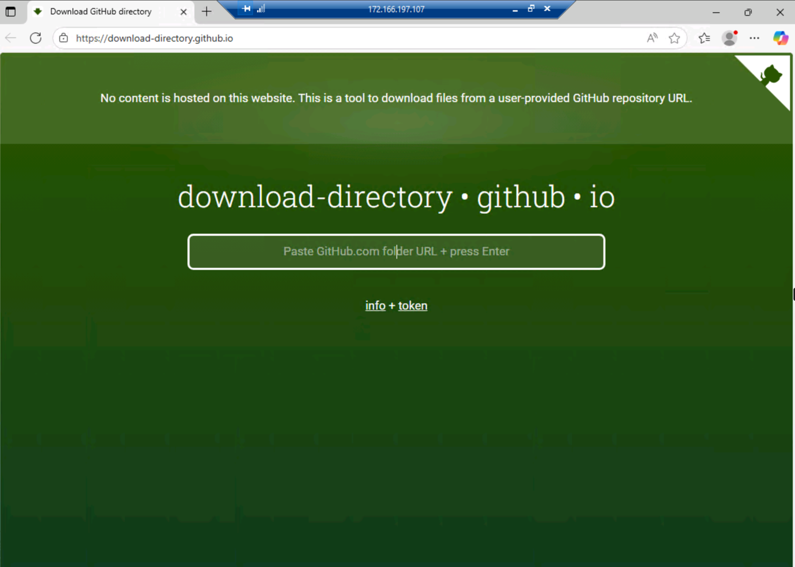

27. Enter +++https://github.com/Labsrepo/Labfiles+++ and
    press **Enter**.

    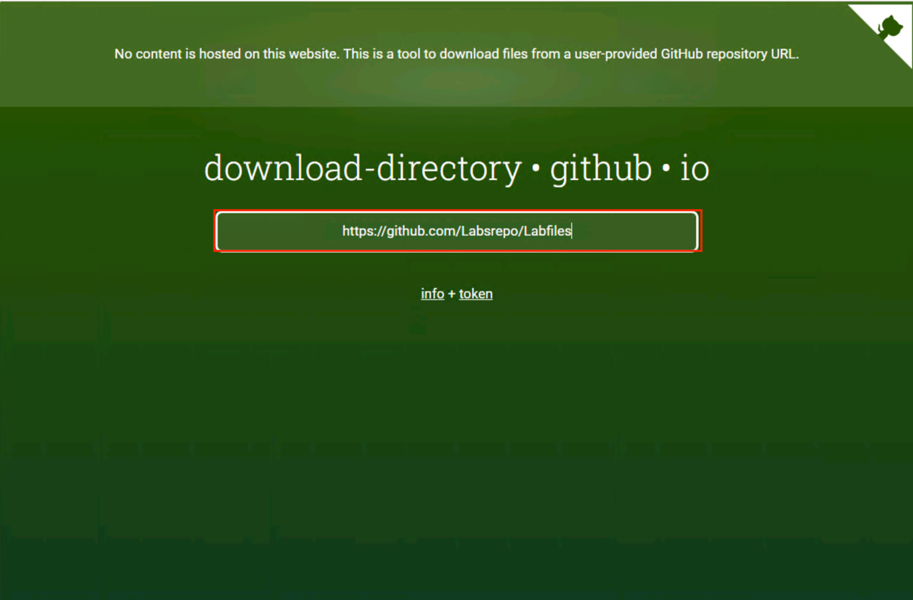

28. Open the folder where the file is downloaded and unzip the
    downloaded folder, and then unzip the adventureworks zip file from
    it.

    

    This will be used as the input data in this exercise.

29. Create a folder named **Labfiles** in the C drive and paste
    **adventureworks2019.bak** file in it.

    

    

30. Open the **SQL Server Management Studio 20** from the Windows Start
    menu.

    

31. Ensure that the below details are selected, and update if the values
    are different.

    - Server name - Enter +++SQLVM+++

    - Authentication Type - Windows Authentication

    - Encryption – Optional

    - Trust Server certificate – Select the checkbox.

    

32. The connection succeeds and gets connected to the SQL Server.

    

33. Right click on the Databases – Select **Restore Database**.

    

34. In the Restore Database page, select **Device** -\> select the
    **three dots** to navigate to the File Explorer in order to upload
    the database.

    

35. Click on **Add**.

    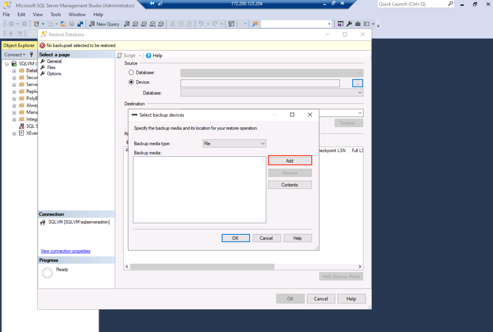

36. There is a .bak file of the **Adventureworks** database under
    **C:\LabFiles**. Navigate to the path and select
    **AdventureWorks2019.bak** and select **OK**. Select **OK** once the
    file is uploaded.

    

37. Click **OK**.

    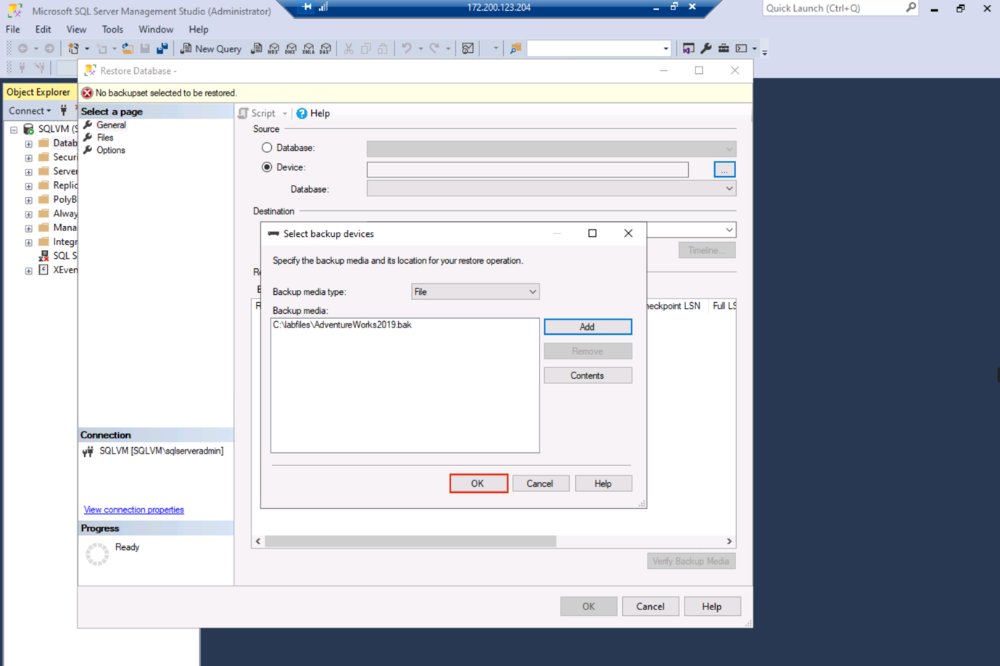

38. In the Restore pane, ensure that the uploaded .bak file is selected
    and then click on **OK**.

    

39. Once the upload is **successful**, you will get a success message
    that the upload is completed.

    

40. Now, you have an On-prem SQL Server with the Adventure Works
    database inside it.

    

    The aim is to migrate this DB to the Azure SQL Database. Now minimise
    the VM.

## Exercise 2 - Create an Azure SQL Database

In this exercise, you will create an Azure SQL Database to which you
will migrate your on-prem database.

1.  Close the VM and in a new window open the Select SQL Deployment
    option page at
    +++https://portal.azure.com/#create/Microsoft.AzureSQL+++ and
    select **Show options**.

    

2.  Select the **Create SQL Database** option.

    

3.  In the **Create SQL Database** page, click on **Create New** under
    Resource group – Type in the **Name** as +++**RG4TargetDB**+++.
    Select **OK**.

    

4.  Enter the **Database name** as +++**adventwkdb**+++ and select
    **Create new** under **Server**.

    

5.  Enter the below details and click **OK**.

    - Server name - Enter +++mysqlserver789698+++

    - Location – Select **East US2**

    - Authentication method – Use **SQL authentication**

    - Server admin login - +++tgsqlserveradmin+++

    - Password - +++sqlPwd981!2@98+++

    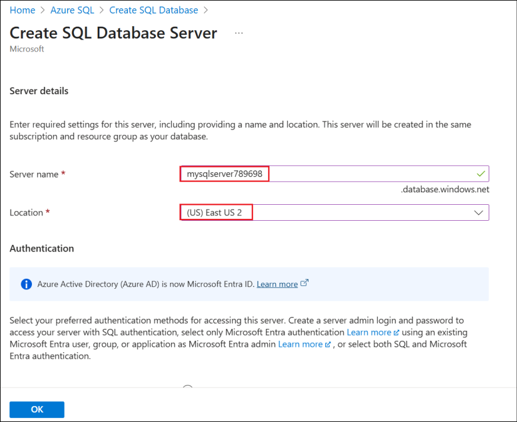

    

6.  Back in the Create SQL Database page, update the details below and
    select **Next: Networking.**

    - Want to use an elastic pool – Select **No**

    - Workload environment – Select **Development**

    - Backup storage redundancy – Select **Locally-redundant backup
      storage**

    

    

7.  In the Networking page, select the below options and select **Next :
    Security**.

    - Connectivity method – Select **Public endpoint**

    - Add current client IP address – **Yes**

    - Connection policy – Select the **Default** option

    

8.  Accept the defaults in the **Security** page and then click on
    **Next : Additional Settings**. Accept the defaults in the other
    pages and navigate to the **Review + create** page, and click on
    **Review + create**.

    

    

    

9.  Once the validation completes, select **Create** to create the
    resource.

    

    

10. Once the deployment succeeds, select **Go to resource**.

    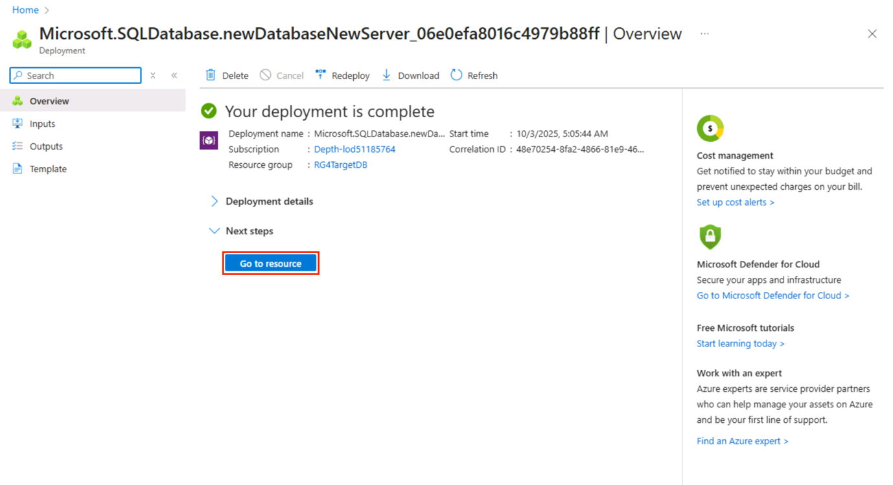

    

11. From the overview page, copy the value of the **Server name** and
    save it in a notepad for usage in future exercise.

    

## Exercise 3 – Create Data Migration Service

In this exercise, you will create a Data Migration Service using which
you will be migrating the database.

1.  From the database page, select **Query editor** from the left pane.

    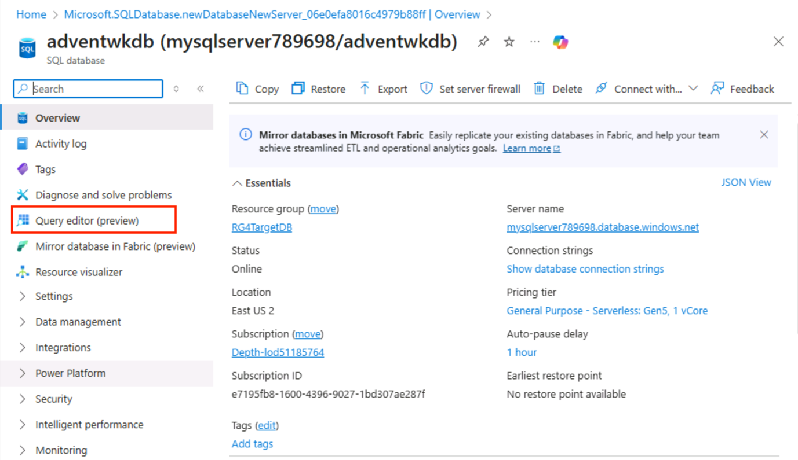

2.  Login using

    - Login – Enter +++**tgsqlserveradmin**+++

    - Password – Enter +++**sqlPwd981!2@98**+++

    

3.  To create the login and user on the target Azure SQL Database, run
    the following script

    ```
    CREATE USER [migrationuser] WITH PASSWORD = 'sqlPwd981!2@98'; 
    ALTER ROLE db_owner ADD MEMBER [migrationuser]; 
    ```

    

    **Note:** If you get a pop-up stating “Your unsaved edits will be discarded”. Then click **OK**.

4.  Navigate to the Home page of the Azure portal. From the search bar,
    search for and select +++**Azure Database Migration Service**+++

    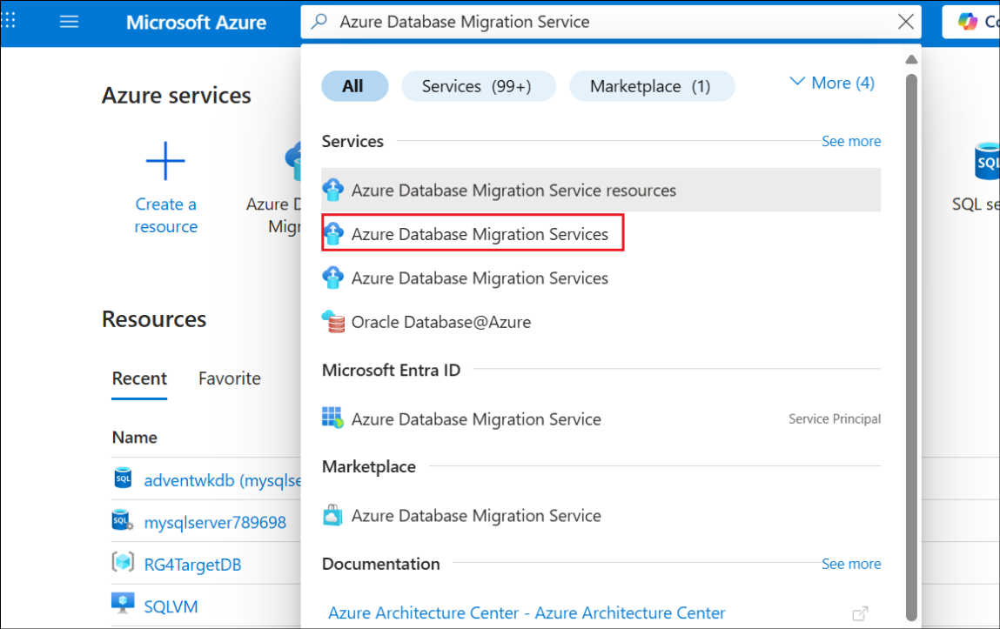

5.  Select the **Start a new migration** option.

    

6.  Enter the details below and select **Select**.

    - Source server type – Select **SQL Server**

    - Target server type – Select **Azure SQL Database**

    - Database Migration Service – Select **Database Migration Service**

    

7.  In the **Create Data Migration Service** page, enter the below
    details and select **Review + create**.

    - Subscription – Select your assigned **subscription**

    - Resource group – Select **RG4TargetDB**

    - Location – Select **East US 2**

    - Migration Service Name – Enter +++**dbMigrate**+++

    

8.  Once the validation passes, select **Create**.

    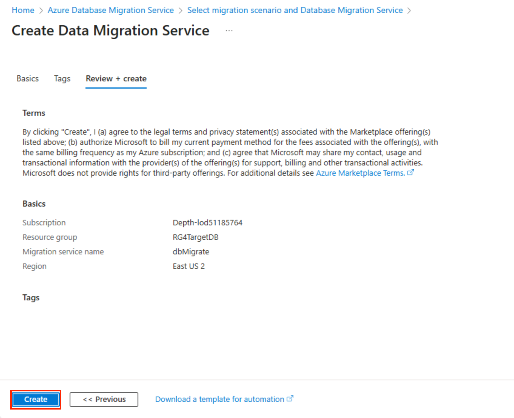

9.  Click on **Go to resource** to go to the created Migration Service
    resource.

    

10. A self-hosted integration runtime is required to access your source
    database backups, check the validity of the backup set, and upload
    backups to Azure storage account.

11. In the **dbMigrate** resource that you just created, select the
    **View integration runtime** option.

    

12. Select Configure integration runtime option.

    

13. Select the **Download and install the integration runtime** option,
    and click on Download in the browser that opens.

    

    

14. Select the first option and click on **Download**.

    

15. Double click on the downloaded file and follow the prompts to
    complete the installation.

    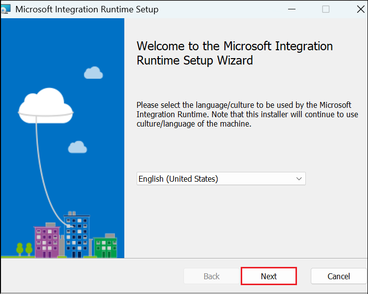

    

    

16. Click **Finish**.

    

17. Once the installation is complete, the **Integration Runtime** asks
    for an **Authentication Key**. Copy the same from the Azure portal
    as in the screenshot below and paste it in the **Integration Runtime
    Configuration Manager** and click on **Register**.

    

    

18. Once the registration is successful, **close** the Configuration
    Manager.

    

19. Click **Close**.

    

20. Once this is done, after few minutes, the status of the Integration
    runtime will change to **Online**. Proceed to the next step once it
    is **Online**.

    

## Exercise 4 - Migrate SQL Server to Azure SQL Database (offline)

In this exercise, you will perform the most important part – **The
Migration**. You will use the Database Migration System (DMS) in Azure
to perform the same.

1.  From the dbMigrate Overview page, select **New Migration**.

    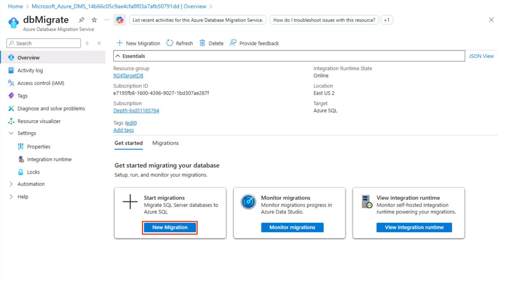

2.  In the **Select new migration scenario**, select the below details
    and select **Select**.

    - Source server type – Select **SQL Server**

    - Target server type – Select **Azure SQL Database**

    

3.  In the **Azure SQL Database Offline Migration Wizard**, enter the
    below details and select **Next: Connect to source SQL Server**

    - Source Infrastructure Type – Select **Virtual Machine**

    - Resource group – Select **ResourceGroup1**

    - Location – **@lab.CloudResourceGroup(ResourceGroup1).Location** is
    used here

    - SQL Server Instance Name – Give the **VM’s IP address** (This will be
    a unique value)

    

4.  In the next screen, enter the below details and then select **Next:
    Select Databases for migration**.

    - Source server name – Enter the VM IP address

    - Authentication type – Select **SQL Authentication**

    - User name – Enter +++sqlserveradmin+++

    - Password – Enter +++sqlPwd981!2@98+++

    

    

5.  Next, select **AdventureWorks2019** database and select Next:
    Connect to targe Azure SQL Database.

    

6.  In the next screen, the details of the target DB are populated.
    Check these, enter the password as +++ sqlPwd981!2@98+++ and select
    **Next: Map source and target databases**.

    

7.  Select the Target database as +++**adventwkdb**+++ and select
    **Next: Select Database tables to migrate**

    

8.  In the next page, you can select either one of the tables for
    testing, or select all the tables and then select **Next: Database
    migration summary**. Check the details and select the **Start
    migration** option.

    

    

    

    

    The migration takes around 30 minutes to complete. Once the migration is
    complete, the status changes to **Succeeded**.

    

## Exercise 5 - Check the migrated Database

Now that the migration is complete, you should check the database that
is migrated to Azure. We will use the **SQL Server Management Studio**
to do the same.

1.  Open the **SSMS** from your system (not the Azure VM).

    

2.  Select **Connect** -\> **Database Engine**. Fill in the details as
    below and then select **Connect**.

    - Server Name – Ente the **Server name** that you saved after creating
    the Azure SQL Database

    - Administration – Select **SQL Server Authentication**

    - User Name – Enter +++**tgsqlserveradmin**+++

    - Password – Enter +++**sqlPwd981!2@98**+++

    - Encrypt – Select **Optional** and check mark **Trust Server
    Certification**.

    

3.  Once connected, check the databases.

    

4.  You will find the migrate Adventureworks Database that got migrated
    from the SQL Server.

    

## Summary

In this lab, you created a SQL Server VM in Azure, deployed the
AdventureWorks database, and prepared it for migration. You then set up
and used the Azure Database Migration Service (DMS) to perform an
offline migration of the database from the SQL Server VM to Azure SQL
Database. Through this process, you learned the key steps involved in
assessing readiness, configuring source and target environments, and
executing a secure and reliable migration. This hands-on exercise
highlighted best practices for migrating SQL Server workloads to Azure
SQL Database, enabling a smoother transition to a fully managed cloud
environment.

===

# Lab 3 - Migrate on-premise PostgreSQL to Azure Database for PostgreSQL flexible server

### Time Duration – 60 mins

## Scenario

Terra Firm Laboratories is a global bioengineering company that’s the
leading researcher and innovator in genetic and biological science
technology. The company was founded in 1975 with its c7orporate
headquarters in Palo Alto, CA. Their mission-critical workloads are
currently hosted in an on-premises datacenter and are beginning a
journey to modernize and migrate into the cloud using Microsoft Azure.

The CTO, Dennis Nedry, has kicked off an initiative for the organization
to begin adopting the Microsoft Azure cloud and modernize its
infrastructure. He has already had his team begin assessing their
current environment and what it will take to migrate to the cloud. They
are looking to optimize their technology investments by reducing
technical debt and streamlining operations using Azure
Infrastructure-as-a-Service (IaaS) and Platform-as-a-Service (PaaS)
cloud services.

Terra Firm Laboratories has already completed the first round of
analysis to identify the applications and workloads to begin migrating
first. Out of over 250 workloads they have running on-premises, they
have identified one workload that exemplifies multiple components common
across many of their other workloads. They decided to use a simpler
workload that will still assist in proving out the migration plan as
it’s developed. This workload includes a web-based order system written
in PHP that is running on Red Hat Enterprise Linux (RHEL) servers
connecting to a PostgreSQL database on-premises.

This lab will cover the database migration part alone. In this lab,
attendees will perform the migration of the on-premises database to an
Azure Database for PostgreSQL Flexible Server - a managed database
service.

Azure services and related products

- Azure VMs

- Azure Arc

- Azure Database for PostgreSQL - Flexible Server

- Azure Networking

- Migration service in Azure Database for PostgreSQL

- Azure Data Studio

- Azure Defender

- Azure Firewall

## Solution Architecture


In this lab we are going to:

- Provisioning a Linux Server VM

- Set up a Linux Server for application migration to Azure

- Migrate an on-premises PostgreSQL Database to Azure Database for
  PostgreSQL - Flexible Server

## Exercise 1 - Lab Setup

In this exercise, you will perform steps toward migrating Terra Firm
Laboratories on-premises Linux Servers and PostgreSQL workloads to
Azure. Terra Firm Laboratories needs a new Linux Server VM created in
Azure for hosting their Web application, an on-premises PostgreSQL
database migrated to Azure PostgreSQL PaaS, a secure Linux Server, and
an on-premises Linux Server VM to be Azure Arc-enabled. Terra Firm
Laboratories already has a Hub and Spoke network setup in Azure with
Azure Bastion for enabling secure remote management of Azure VMs using
Azure Bastion. The Azure resources provisioned throughout this lab will
be deployed into this environment.

### Objectives

After completing this exercise, you will be able to:

- Deploy ARM Template

- Verify the on-premises web application

### Task 1 – Create resources

In this task, you will leverage a custom Azure Resource Manager (ARM)
template to deploy the Azure resources and create a simulated
on-premises environment for Terra Firm Laboratories.

1.  Open a browser and navigate to +++https://portal.azure.com/+++. Now,
    sign in with your cloud slice account:

    - Username: +++@lab.CloudPortalCredential(User1).Username+++

    - TAP Token - +++@lab.CloudPortalCredential(User1).AccessToken+++

    

    

    

    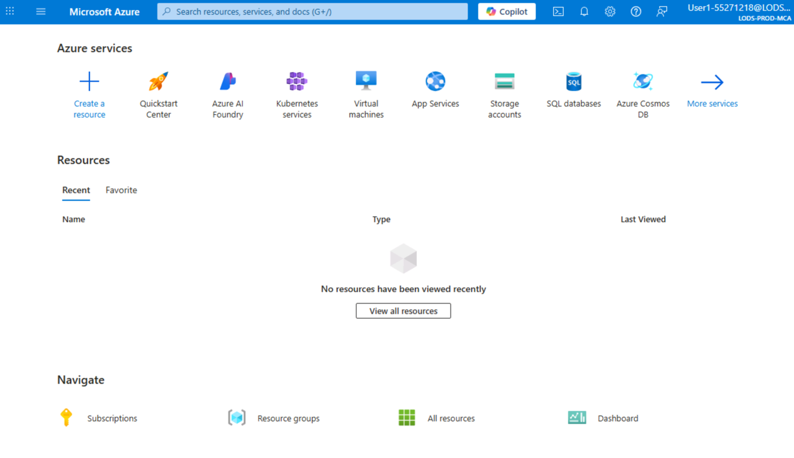

2.  Open a new tab in the browser, and navigate to the following link to
    get the ARM template: 

    +++https://github.com/technofocus-pte/MigrateLinuxworkloads/tree/main/resources/deployment+++

3.  Select **Deploy to Azure**. This will open a new browser tab to the
    Azure Portal for custom deployments.

    

5.  Fill in the required ARM template parameters.

    - **Subscription:** Use the default one

    - **Resource group:** Select **ResourceGroup1**

    - **Region:** Select
      @lab.CloudResourceGroup(ResourceGroup1).Location

    - **Resource Name Base:** Enter +++terrafirm@lab.LabInstance.Id+++

    - **Password:** Enter +++pass@dmIn234+++

    Select **Review + create**

    

6.  Click on the **Create** button to start deployment.

    

7.  The deployment is now underway. On average, this process can take
    10-20 minutes to complete.

    

    **Note**: While automation can make things simpler and repeatable,
    sometimes it can fail. If at any time during the ARM template deployment
    there is a failure, review the failure, delete the Resource Group, and
    try the ARM template again. Or review the failures and adjust for errors
    as appropriate.

8.  Once the ARM template is deployed successfully, the status will
    change to complete. Click on **Go to resource group** to open the
    resource group.

    

### Task 02 - Configure On-Premises Web Application

In this task, you will configure the web application hosted on the
simulated on-premises APP virtual machine that was provisioned by the
ARM Template deployment.

1.  Select the **On-premises Workload VM** named similar
    to **terrafirm**@**lab.LabInstance.Id-onprem-workload-vm**.

    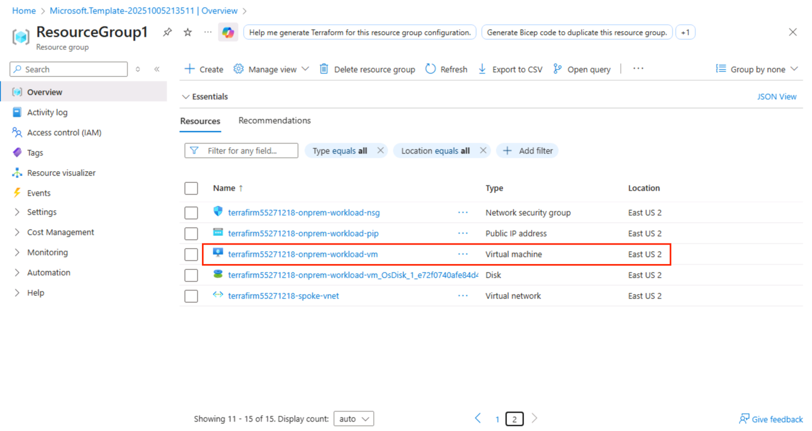

2.  In the **Overview** page, go to **Properties**, and under the
    **Networking** section, locate the **Private IP Address** of the VM
    and copy it into Notepad.

    **Note:** You will need this IP address to configure the web application
    to use the database workload server.

    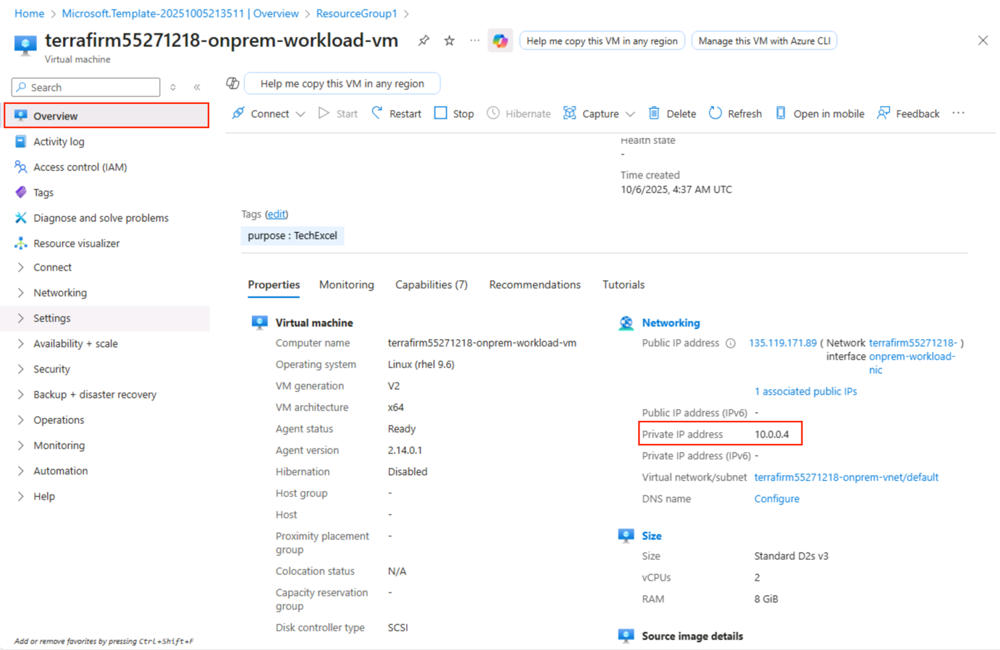

3.  Navigate back to the **ResourceGroup1**, then select
    the **On-premises APP VM** named similar
    to **terrafirm**@**lab.LabInstance.Id-onprem-app-vm**.

    

4.  Search for +++**Bastion**+++ in the left-hand menu and then select
    **Bastion**. We will use a bastion host as the method to connect to
    our VMs, as this is a more secure method.

    

5.  Within the **Bastion** page, enter the following details:

    - **Authentication Type:** VM Password

    - **Username:** Enter +++demouser+++

    - **VM Password:** Enter +++pass@dmIn234+++

    Then click on the **Connect** button to connect with Bastion.

    

    **Note**: You may need to **allow pop-ups** if they are blocked in your browser.

6.  When connected to the VM via the Bastion host, you will get a screen
    like this:

    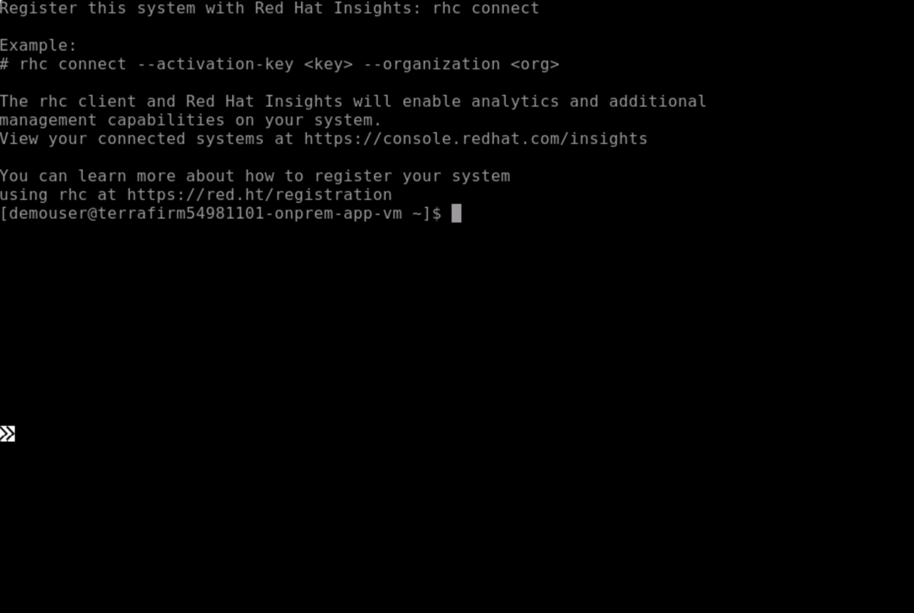

    **Note**: If you see a pop-up stating “See test and images copied to the
    clipboard”. Click **Allow**.

7.  Once connected via Bastion, enter the following command to install
    the git utility on the server.

    +++sudo yum install git -y+++

    

8.  Enter the following command to clone the remote git repository
    holding a script which will configure the web app on the application
    server.

    +++sudo git clone
    https://github.com/technofocus-pte/TechExcel-Migrate-Linux-workloads.git+++

    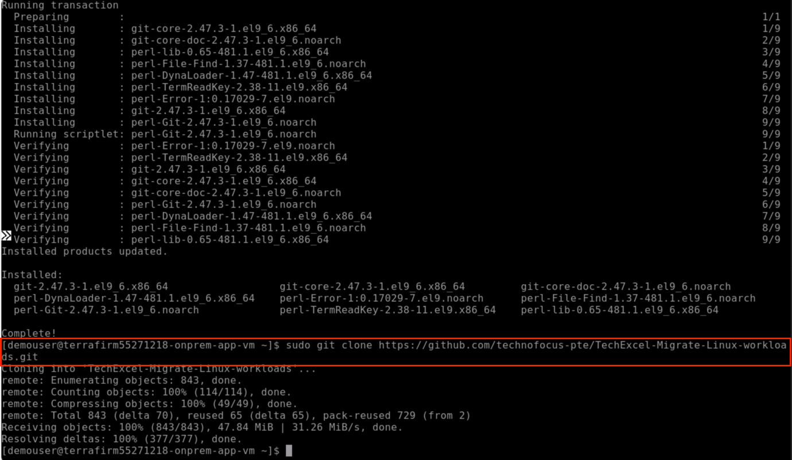

9.  You can now run the configuration script by using the following
    command:

    ++++sudo bash
    TechExcel-Migrate-Linux-workloads/resources/deployment/onprem/APP-workload-install.sh+++

    You will get a status message of  “The script
    was successful”.

    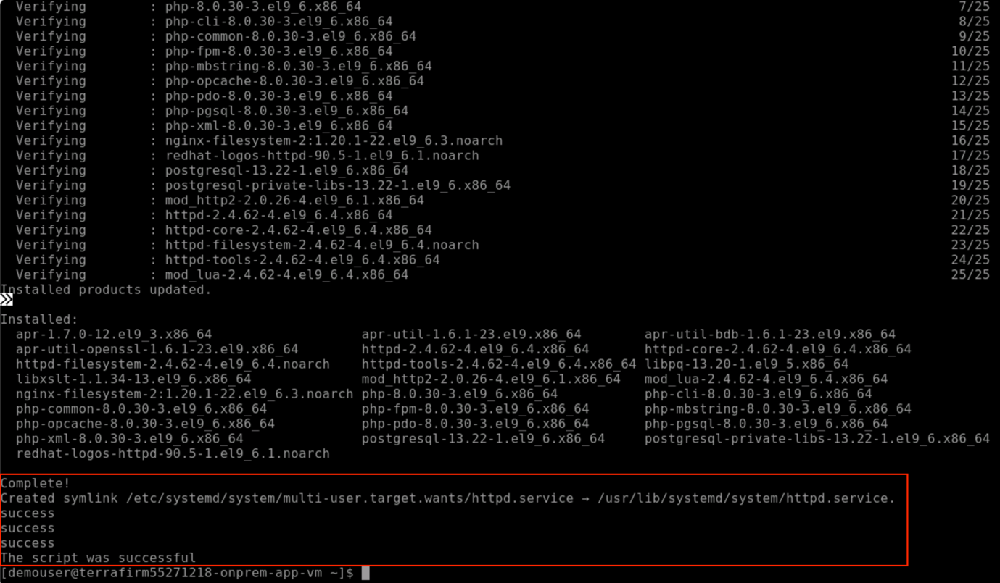

10. Execute the following command to open the **orders.php** file for
    the web application in a text editor. The application needs to be
    configured to connect to the **Azure Database for PostgreSQL
    Flexible Server** database.

    +++sudo nano /var/www/html/orders.php+++

    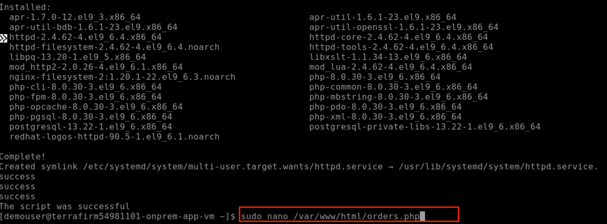

    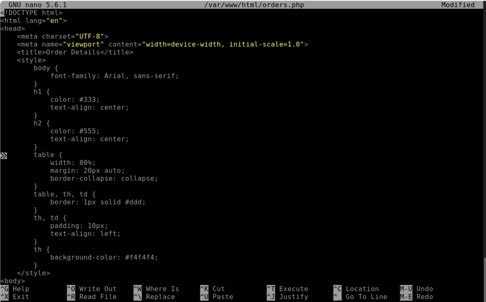

11. Use the **down arrow** key to scroll down in the order.php file
    until you locate $host, $port, $dbname, $user, and $password.  
    

12. Check the host IP address and configure it to match the **Private IP
    Address** of the **terrafirm**@lab.LabInstance.Id
    **-onprem-workload-vm** instance. If the host IP is already correct,
    skip to steps 13 and 14. And press **Ctrl+X** to exit the editor.

    

13. If the host IP is not the same, then replace it with the **Private
    IP Address** of the **terrafirm-onprem-workload-vm** instance that
    was copied in step 2. Then press **Ctrl+X**.

    

14. Press +++**Y**+++ to save the modified buffer and then press
    **Enter** to write the changes in the file.

    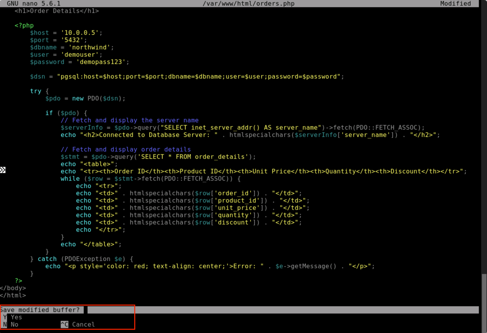

    

15. You are now exited from the orders.php file with the changes saved.

    

You have now learnt some basic Linux commands and configured the web
application to use the database on an internal network rather than
across the internet.

### Task 03 - Validate on-premises web application

In this task, you will validate the web application hosted on the
simulated on-premises APP virtual machine that was provisioned by the
ARM Template deployment.

1.  Navigate back to Azure Portal, open the ResourceGroup1, then select
    the **On-premises APP VM** named similar
    to **terrafirm@lab.LabInstance.Id-onprem-app-vm**.

    

2.  In the **Overview** window, go to **Properties**. Under the
    **Networking** section, locate the VM’s **Public IP Address** and
    copy it into Notepad.

    

3.  Open a new browser window, then navigate to the
    following **http:// URL** to access the simulated on-premises web
    application provisioned for this lab. Be sure to replace
    the **\<ip-address\>** placeholder with the Public IP Address for
    the VM. For example: http://172.206.126.43

    +++http://\<ip-address\>+++

    **Note:** You should get the Red Hat Enterprise Linux Test Page 

    

4.  When the web page loads, enter the following at the end of the URL.
    For example: "http://172.206.126.43/orders.php"

    +++http://\<ip-address\>/orders.php+++  
    

    Now, things are ready for you to go through the lab.

## Exercise 2 - Migrate a PostgreSQL Database

In this exercise, you will migrate the on-premises PostgreSQL database
for the web application workload to Azure. The migration service in
Azure Database for PostgreSQL will be used to perform the database
migration from the PostgreSQL server on-premises to the Azure Database
for PostgreSQL service.

### Objectives

After you complete this exercise, you will be able to:

- Create an Azure Database for PostgreSQL - Flexible Server instance

- Create a database hosted in this instance, which will be the target
  for migration

- Set up a migration project in Azure Database for PostgreSQL Flexible
  Server

- Migrate your database from on-premises to Azure Database for
  PostgreSQL Flexible Server

### Task 01 - Create Azure Database for PostgreSQL

In this task, you will create a new PostgreSQL database that will be the
target for the database migration.

1.  Navigate back to the **Azure portal-\>Home-\>Create a resource**.

    

2.  In the **Marketplace** window, search for +++**PostgreSQL
    flexible**+++, then select **Azure Database for PostgreSQL Flexible
    Server** from the search results.

    

3.  Click **Create** and then select **Azure Database for PostgreSQL
    Flexible Server.**

    

4.  On the **New Azure Database for PostgreSQL** **Flexible
    Server** pane, select the following values:

    1.  **Subscription:** Keep default

    2.  **Resource group:** Select **ResourceGroup1**

    3.  **Server name:** Enter
        +++**terraform-postgresql-db@lab.LabInstance.Id**+++

    4.  **Region:** Select
        @lab.CloudResourceGroup(ResourceGroup1).Location

    5.  **PostgreSQL version:** Keep the default, as it always selects
        the latest version

    6.  **Workload type:** Select **Development**

    

5.  Under **Compute + storage,** click **Configure server**.

    

6.  On the Compute + storage window, under the **compute** section,
    choose the following:

    1.  **Compute tier:** Select **General Purpose (2-64 vCores) -
        Balanced configuration for most common workloads**

    2.  **Compute Size:** Select **Standard_D4ds_v4 (4 vCores, 16GiB
        memory, 6400 max iops)**

    

7.  Under the **High availability** section, choose **Disabled (99.9%
    SLA)** and then click **Save.**

    

8.  On the **New Azure Database for PostgreSQL** **Flexible Server**
    window, under the **Authentication** section, enter the following
    details:

    - **Authentication method**: Choose **PostgreSQL authentication
      only**

    - **Admin username**: Enter +++pgadmin+++

    -  **Password**: Enter +++passadmin3@2+++

    Select **Next: Networking**

    

9.  In the **Networking** tab, under **Public access**, clear the
    checkbox to disable public access.
    
    

10. Under **Private endpoint** section, select **Create private endpoint**. 
    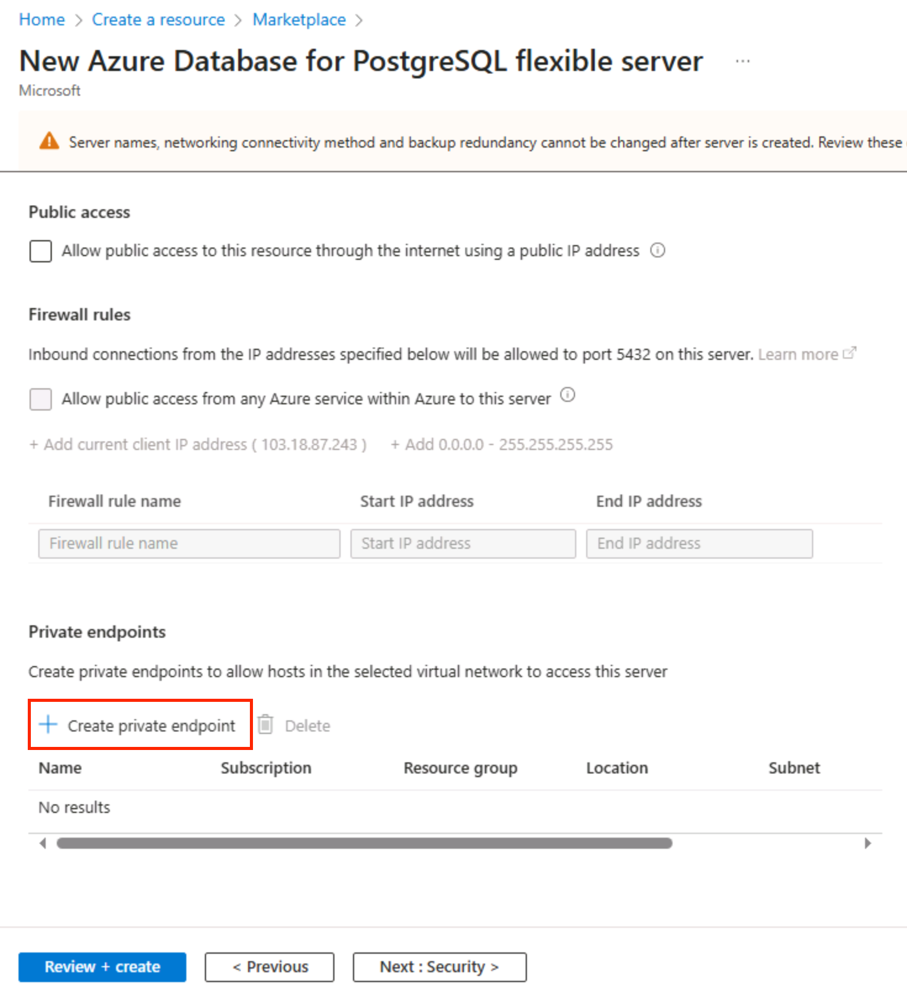

11. On the **Create private endpoint** window, enter the following
    details:

    1.  **Subscription:** Keep default

    2.  **Resource group:** ResourceGroup1

    3.  **Location**: @lab.CloudResourceGroup(ResourceGroup1).Location

    4.  **Name:** Enter +++post-priv-endpoint+++

    5.  **Virtual network:** Select
        **terraform@lab.LabInstance.Id-spoke-vnet(ResourceGroup1)**

    6.  **Subnet**: Select **default**(10.2.0.0/24)

    7.  **Integrate with privet DNS zone:** Select No (You will use an
        IP address rather than a DNS entry when connecting.)

    8.  Click **OK**

    

    

12. Select **Review + create**.

    

13. Select **Create** to provision the service.

    

14. Click **Create server without firewall rules** - as you will use the
    private endpoint for access.
    
    

15. Wait for deployment to complete; it will take 5-10 mins. Once
    provisioning has finished, click on **Go to resource**.

    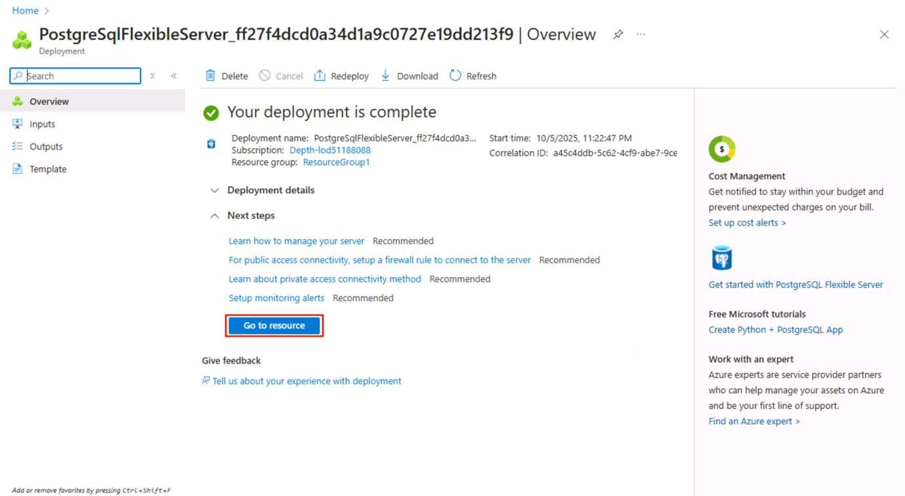

16. In the Overview tab of the **Azure Database for PostgreSQL flexible
    server,**  copy and save the **Server name** in Notepad for use
    later.

    

17. On the left menu pane,
    under **Settings,** select **Databases**.
    
    

18. Select **+ Add** to create a new database.

    

19. On the **Create Database** window, enter +++**northwind**+++ in
    the Name field, then select **Save**. This will create a new
    PostgreSQL database that will be the target for the database
    migration.
    
    

    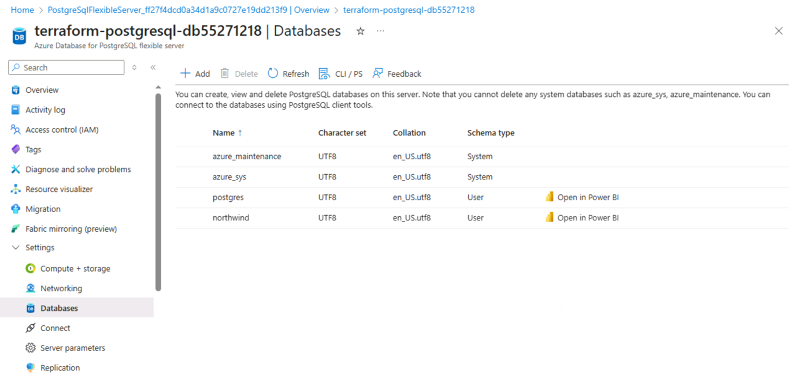

### Task 02 - Migrate your database to Azure Database for PostgreSQL flexible server

In this task, you will set up a migration project and configure the
Source and Target connections. You will then execute and monitor a
migration of your on-premises PostgreSQL database into Azure Database
for PostgreSQL - flexible server.

1.  Select **Migration** from the menu on the left of the flexible
    server blade.

    

2.  Click on the **+ Create**.

    

    **Note**: If the **+ Create** option is unavailable,
    select **Compute + storage** and change the compute tier to
    either **General Purpose** or **Memory Optimized** and try to create
    the Migration process again. After the Migration is successful, you
    can change the compute tier back to **Burstable**.

3.  On the **Setup** tab, enter each field as follows:

    1.  **Migration name:** Enter +++Migration-northwind+++

    2.  **Source server type:** Select On-premise Server.

    3.  **Migration option:** Select Validate and Migrate.

    4.  **Migration option:** Select Offline

    5.  Select **Next: Runtime server \>**

    

    **Note:** The Runtime server \> button might be enabled after 20-30 mins.

4.  We will **not** use a Runtime Server, so just select **Next: Source
    server \>**.

5.  On the **Source server** tab, enter each field as follows:

    1.  Server name: The public IP address of the
        “terraform-onprem-workload-vm”.

        

    2.  **Port:** +++5432+++

    3.  **Server admin login name:** rootuser(the VM has been setup with an
        admin user called rootuser)

    4.  **Password:** Enter+++123rootpass456+++

    5.  **SSL mode:** Prefer.

    6.  Click on the **Connect to source** option to validate the
        connectivity details provided.

    7.  Click on the **Next: Target server\>** button to progress.

        

6.  The connectivity details should be automatically completed for the
    target server we are migrating to.

    - In the password field -  Enter +++passadmin3@2+++

    - Click on the **Connect to target** option to validate the
      connectivity details provided.

    - Click on the **Next: Databases to validate or migrate \>** button
      to progress.

    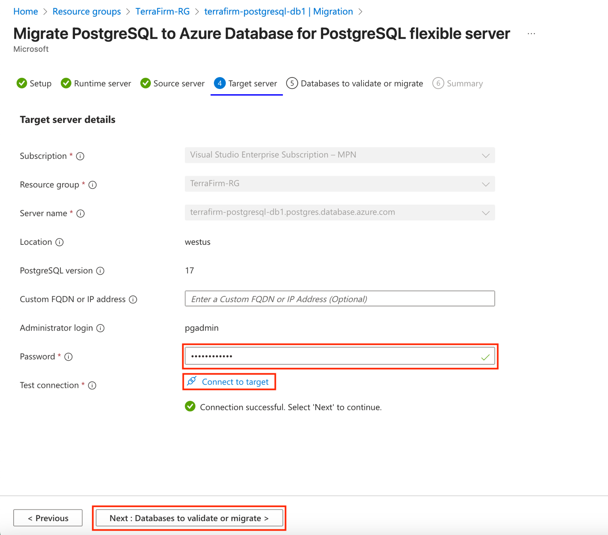

7.  On the **Databases to validate or migrate** tab, select the
    **northwind** database because you want to migrate to the flexible
    server. Then click on the **Next : Summary \>** button to progress
    and review the data provided

    

8.  On the **Summary** tab, review the information and then click
    the **Start Validation and Migration** button to start the migration
    to the flexible server.

    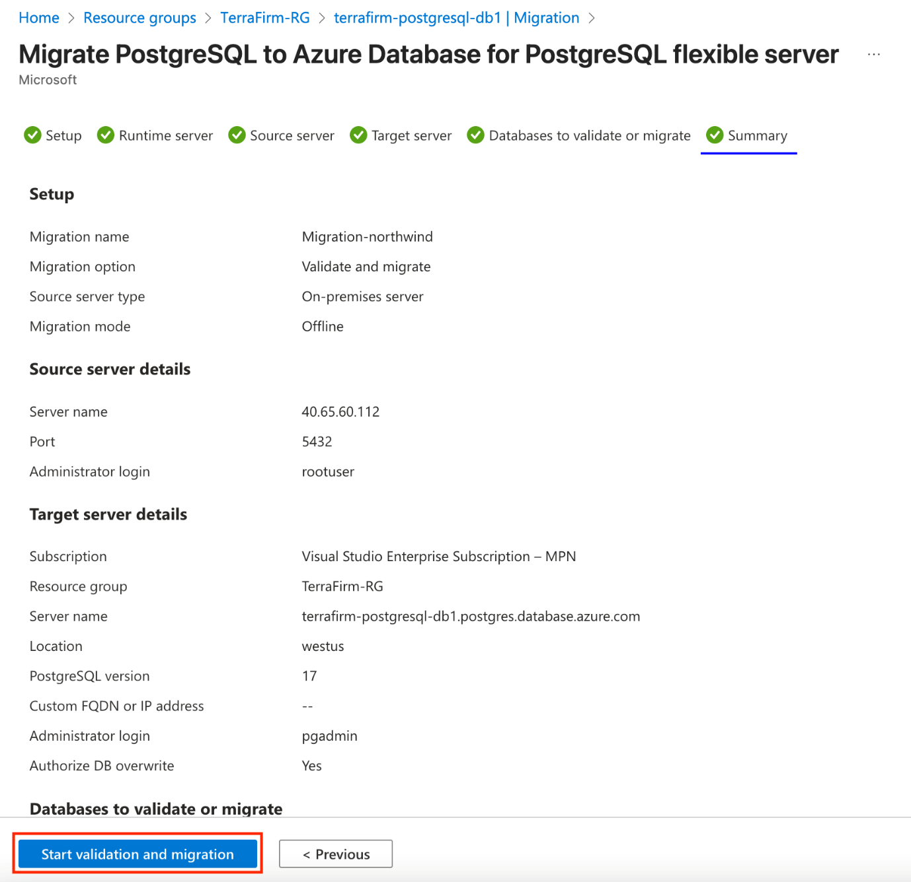

9.  On the **Migration** tab, you can monitor the migration progress by
    using the **Refresh** button in the top menu to view the progress
    through the validation and migration process.

10. By clicking on the **Migration-northwind** activity, you can view
    detailed information about the migration activity’s progress.

    

## Summary:

In this lab, you learned how to deploy a simulated on-premises
environment using an ARM template and configure a Linux-based web
application to connect to a PostgreSQL database. You gained hands-on
experience using Azure Bastion for secure VM access and editing
application configuration files in Linux. You also learned how to
provision an Azure Database for PostgreSQL Flexible Server with private
networking, create a target database, and set up a migration project.
Finally, you learned how to validate connectivity, perform an offline
migration using the Azure PostgreSQL migration service, and monitor the
end-to-end migration process from an on-premises PostgreSQL server to
Azure.
