# Lab 6 - Build a Q&A chatbot with Azure App Service and Azure OpenAI chat completion model

### Time Duration: 50 mins

In this tutorial, you'll build an intelligent AI application by
integrating Azure OpenAI with a Java Spring Boot application and
deploying it to Azure App Service. You'll create a Razor page that sends
chat completion requests to a model in Azure OpenAI and streams the
response back to the page.


In this tutorial, you learn how to:

- Create an Azure OpenAI resource and deploy a language model

- Build a Blazor application with Azure OpenAI

- Deploy the application to Azure App Service

- Implement passwordless authentication both in the development
  environment and in Azure

## Prerequisites

- A GitHub account  for using GitHub Codespaces. If you don’t have
  Github account then you can create from
  [here](https://github.com/signup?ref_cta=Sign+up&ref_loc=header+logged+out&ref_page=%2F&source=header-home).

## Task 1: Register Resource provider

In this task, we will register all the resource providers used in this
lab.

1.  Open a web browser of your choice and navigate to the Azure portal
    +++https://portal.azure.com+++.

2.  Sign-in using the given cloud slice credentials:

    - Username - +++@lab.CloudPortalCredential(User1).Username+++

    - TAP Token - +++@lab.CloudPortalCredential(User1).AccessToken+++

    

    

    

3.  Click on the **Subscriptions** tile.

    

4.  Click on the **subscription name**.

    

5.  Expand Settings from the left navigation menu. Click on **Resource
    providers**, enter +++**Microsoft.Web**+++ and select three dots,
    and then click **Register**.

    

    

6.  Similarly register the following:

    - +++**Microsoft.CognitiveServices**+++

    - +++**Microsoft.ServiceLinker**+++

## Task 2: Create an Azure OpenAI resource

In this task, you'll use GitHub Codespaces to create an Azure OpenAI
resource with the Azure CLI.

1.  Go to **GitHub Codespaces** +++https://github.com/codespaces+++ and
    sign in with your GitHub account.

    

2.  Find the **Blank** template on GitHub and select **Use this
    template** to create a new blank Codespace.

    

3.  Wait for the Codespaces environment to setup. It takes few minutes
    to setup completely.

    

4.  In the Codespace terminal, run the following command to install the
    Azure CLI:

    +++curl -sL https://aka.ms/InstallAzureCLIDeb | sudo bash+++

    

5.  Run the following command to sign in to your Azure account. Copy the
    generated code, then open the provided URL and paste the code when
    prompted.

    +++az login+++

    

6.  Enter the given authentication code and click on the **Next**
    button.  

    

    **Note:** The authentication code is always different each time we login.

7.  Select your Azure account.  

    

8.  Click on the **Continue** button, and your Azure account is logged
    in successfully.

    

    

9.  Navigate back to the Codespace terminal and press +++**1**+++ to
    select your subscription and tenant.  
    
    

    

10. Set environment variables for your **resource group name**, **Azure
    OpenAI service name**, and **location**:

    +++export RESOURCE_GROUP="ResourceGroup1"+++

    +++export OPENAI_SERVICE_NAME="azure-openai-service-@lab.labinstanceid()"+++

    +++export APPSERVICE_NAME="nueralNest-xy@lab.labinstanceid()"+++

    +++export LOCATION="centralcanada"+++  

    

11. Create an Azure OpenAI resource with a custom domain, then add a
    gpt-4o-mini model in the existing resource group:

    ```
    # Azure OpenAI resource
    az cognitiveservices account create --name $OPENAI_SERVICE_NAME --resource-group $RESOURCE_GROUP --location $LOCATION --custom-domain $OPENAI_SERVICE_NAME --kind OpenAI --sku s0
    # gpt-4o-mini model
    az cognitiveservices account deployment create --name $OPENAI_SERVICE_NAME --resource-group $RESOURCE_GROUP --deployment-name gpt-4o-mini --model-name gpt-4o-mini --model-version 2024-07-18 --model-format OpenAI --sku-name Standard --sku-capacity 1
    # Cognitive Services OpenAI User role that lets the signed in Azure user to read models from Azure OpenAI
    az role assignment create --assignee $(az ad signed-in-user show --query id -o tsv) --role "Cognitive Services OpenAI User" --scope /subscriptions/$(az account show --query id -o tsv)/resourceGroups/$RESOURCE_GROUP/providers/Microsoft.CognitiveServices/accounts/$OPENAI_SERVICE_NAME
    ```

    

    Now that you have an Azure OpenAI resource, you'll create a web
    application to interact with it.

## Task 3: Create and set up a Blazor web app

In this task, you'll create a new Blazor web application using the .NET
CLI.

1.  In your Codespace terminal, create a new Blazor app and try running
    it for the first time.

    ```
    dotnet new blazor -o .
    dotnet run
    ```
    These commands will add the project directories on the left-hand side.

    

2.  While running the above commands, you will get a notification in
    GitHub Codespaces indicating that the app is available at a specific
    port. Select **Open in browser** to launch the app in a new browser
    tab.  

    
    
    

3.  Go back in the Codespace terminal, stop the app with **Ctrl+C**.

4.  Install the required **NuGet packages** for working with Azure
    OpenAI:

    ```
    dotnet add package Azure.AI.OpenAI
    dotnet add package Azure.Identity
    ````

    

5.  Open **Components/Pages/Home.razor** and replace its content with
    the following code, for a simple chat completion stream call with
    Azure OpenAI:

    ```
    @page "/"
    @rendermode InteractiveServer
    @using Azure.AI.OpenAI
    @using Azure.Identity
    @using OpenAI.Chat
    @inject Microsoft.Extensions.Configuration.IConfiguration _config

    <h3>Azure OpenAI Chat</h3>
    <div class="mb-3 d-flex align-items-center" style="margin:auto;">
        <input class="form-control me-2" @bind="userMessage" placeholder="Type your message..." />
        <button class="btn btn-primary" @onclick="SendMessage">Send</button>
    </div>
    <div class="card p-3" style="margin:auto;">
        @if (!string.IsNullOrEmpty(aiResponse))
        {
            <div class="alert alert-info mt-3 mb-0">@aiResponse</div>
        }
    </div>

    @code {
        private string? userMessage;
        private string? aiResponse;

        private async Task SendMessage()
        {
            if (string.IsNullOrWhiteSpace(userMessage)) return;

            // Initialize the Azure OpenAI client
            var endpoint = new Uri(_config["AZURE_OPENAI_ENDPOINT"]!);
            var client = new AzureOpenAIClient(endpoint, new DefaultAzureCredential());
            var chatClient = client.GetChatClient("gpt-4o-mini");

            aiResponse = string.Empty;
            StateHasChanged();

            // Create a chat completion streaming request
            var chatUpdates = chatClient.CompleteChatStreamingAsync(
                [
                    new UserChatMessage(userMessage)
                ]);

                await foreach(var chatUpdate in chatUpdates)
                {
                    // Update the UI with the streaming response
                    foreach(var contentPart in chatUpdate.ContentUpdate)
                {
                    aiResponse += contentPart.Text;
                    StateHasChanged();
                }
            }
        }
    }
    ```
    

6.  In the terminal, run the following commands to retrieve your
    **OpenAI endpoint** and save it in a notepad for later use:

    ```
    az cognitiveservices account show \
    --name $OPENAI_SERVICE_NAME \
    --resource-group $RESOURCE_GROUP \
    --query properties.endpoint \
    --output tsv
    ```

    

7.  Run the app again by adding **AZURE_OPENAI_ENDPOINT** with the value
    saved in the previous step.
    +++AZURE_OPENAI_ENDPOINT="replace-with-output-from-previous-cli-command" dotnet run+++

    

8.  Select **Open in browser** to launch the app in a new browser tab.

    

    

9.  Type the following prompt in the textbox and select **Send** and
    give the app a few seconds to reply with a message from Azure
    OpenAI.

    +++What is Azure?+++

    

The application uses DefaultAzureCredential, which automatically uses
your Azure CLI signed-in user for token authentication. Later in this
tutorial, you'll deploy your Blazor app to Azure App Service and
configure it to securely connect to your Azure OpenAI resource using
managed identity. The same DefaultAzureCredential in your code can
detect the managed identity and use it for authentication. No extra code
is needed.

## Task 4: Deploy to Azure App Service and configure OpenAI connection

Now that your app works locally, let's deploy it to Azure App Service
and set up a service connection to Azure OpenAI using managed identity.

1.  Navigate back to the terminal and press **Ctrl+C** to terminate the
    running command. Now, deploy your app to Azure App Service using the
    Azure CLI command az webapp up. This command creates a new web app
    and deploys your code to it:
    ```
    az webapp up \
    --resource-group $RESOURCE_GROUP \
    --location $LOCATION \
    --name $APPSERVICE_NAME \
    --plan $APPSERVICE_NAME \
    --sku B1 \
    --os-type Linux \
    --track-status false
    ```
    

    This command might take a few minutes to complete. It creates a new
    web app in the same resource group as your OpenAI resource.

    **Note:** You can safely ignore any errors(such as Zip Deployment
    failed) that are not related to App Service creation. If a timeout
    error occurs, simply re-run the command.

2.  After the app is deployed, create a service connection between your
    web app and the Azure OpenAI resource using managed identity:
    ```
    az webapp connection create cognitiveservices \
    --resource-group $RESOURCE_GROUP \
    --name $APPSERVICE_NAME \
    --target-resource-group $RESOURCE_GROUP \
    --account $OPENAI_SERVICE_NAME
    --connection azure-openai \
    --system-identity
    ```
    

    This command creates a connection between your web app and the Azure
    OpenAI resource by:
    - Generating a system-assigned managed identity for the web app.
    - Adding the Cognitive Services OpenAI Contributor role to the managed identity for the Azure OpenAI resource.
    - Adding the AZURE_OPENAI_ENDPOINT app setting to your web app.

    Your app is now deployed and connected to Azure OpenAI with a managed
    identity.

4.  Navigate to the **Azure portal** and sign in to your account.

    +++https://portal.azure.com/+++

5.  Navigate to **Resource Groups**, open your resource group that is
    **ResourceGroup1**, and select your app that is
    **nueralNest-xy@lab.labinstanceid().**

    

    

6.  On the Overview page of your app, click the **URL** to open the
    deployed web app in a new browser window.

    

    

7.  Type the following prompt in the textbox and select **Send**, and
    give the app a few seconds to reply with a message from Azure
    OpenAI.

    +++What is RAG in Azure?+++

    

## Summary:

In this lab, you provision Azure resources, including an Azure OpenAI
instance with the gpt-4o-mini model. You build a Blazor web app that
integrates with Azure OpenAI for Q&A chatbot functionality. The app is
tested locally in GitHub Codespaces using DefaultAzureCredential, then
deployed to Azure App Service with managed identity for secure access.
Finally, the chatbot is validated through its public URL, streaming
real-time AI responses.

===

# Lab 7 - Build a retrieval augmented generation (RAG) application using Azure OpenAI (text-embedding model) and Azure AI Search and deploy to Azure App Service

### Time Duration: 45 mins

In this tutorial, you'll create a .NET retrieval augmented generation
(RAG) application using .NET Blazor, Azure OpenAI, and Azure AI Search
and deploy it to Azure App Service. This application demonstrates how to
implement a chat interface that retrieves information from your
documents and leverages Azure AI services to provide accurate,
contextually aware answers with proper citations. The solution uses
managed identities for passwordless authentication between services.


In this tutorial, you learn how to:

- Deploy a Blazor application that uses RAG pattern with Azure AI
  services.

- Configure Azure OpenAI and Azure AI Search for hybrid search.

- Upload and index documents for use in your AI-powered application.

- Use managed identities for secure service-to-service communication.

- Test your RAG implementation locally with production services.

## Architecture overview

Before you begin deployment, it's helpful to understand the architecture
of the application you'll build. The following diagram is from custom
RAG pattern for Azure AI Search:  


In this tutorial, the Blazer application in App Service takes care of
both the app UX and the app server. However, it doesn't make a separate
knowledge query to Azure AI Search. Instead, it tells Azure OpenAI to do
the knowledge querying, specifying Azure AI Search as a data source.
This architecture offers several key advantages:

- **Integrated Vectorization**: Azure AI Search's integrated
  vectorization capabilities make it easy and quick to ingest all your
  documents for searching, without requiring more code for generating
  embeddings.

- **Simplified API Access**: By using the Azure OpenAI on your
  data pattern with Azure AI Search as a data source for Azure OpenAI
  completions, there's no need to implement complex vector search or
  embedding generation. It's just one API call, and Azure OpenAI handles
  everything, including prompt engineering and query optimization.

- **Advanced Search Capabilities**: The integrated vectorization
  provides everything needed for advanced hybrid search with semantic
  reranking, which combines the strengths of keyword matching, vector
  similarity, and AI-powered ranking.

- **Complete Citation Support**: Responses automatically include
  citations to source documents, making information verifiable and
  traceable.

## Prerequisites

- A GitHub account for using GitHub Codespaces. If you don’t have GitHub
  account, then you can create from
  [here](https://github.com/signup?ref_cta=Sign+up&ref_loc=header+logged+out&ref_page=%2F&source=header-home).

## Task 1: Open GitHub Codespaces

The easiest way to get started is using GitHub Codespaces, which
provides a complete development environment with all required
preinstalled tools.

1.  Navigate to the GitHub repository +++
    https://github.com/technofocus-pte/appserviceragopenai+++ and sign
    in using your credentials.

2.  Click on **Fork** to fork the repo.

    

3.  Click on **Create fork**.

    

4.  Click on **Code** \> **Codespaces** \> **Create codespace on main**
    to open a new codespace.

    

5.  Wait for the codespace environment to set up. It takes a few minutes
    to set up completely.

    

    

## Task 2: Deploy the given architecture

In this exercise, you are going to deploy the provided architecture to
your Azure account.

1.  In the terminal, log into your Azure using Azure Developer CLI:

    +++azd auth login+++

    

2.  Copy the code and then press the **Enter** key, and it will open a
    new browser window where you need to enter the given code and then
    click the **Next** button.

    

3.  Sign-in to your **Azure account** using the following credentials
    and then click on the **Continue** button.

    - Username: +++@lab.CloudPortalCredential(User1).Username+++

    - TAP Token: +++@lab.CloudPortalCredential(User1).AccessToken+++

    

    

    

    Now your account is successfully connected with the Codespace terminal.

    

    

4.  In the terminal, write the following command to provision the Azure
    resources with the AZD template:

    +++azd provision+++

    

5.  When prompted, enter the following details:

    - **Enter a new environment Name:** +++blazorenv@lab.LabInstance.Id+++

    - **Select Azure Subscription to use:** Select the subscription

    - **Pick a resource group to use:** Select **ResourceGroup1**

    

6.  Wait for the deployment to complete; it will take 5-10 mins. This
    process will:

    - Create all required Azure resources.

    - Deploy the application to Azure App Service.

    - Configure secure service-to-service authentication using managed
    identities.

    - Set up the necessary role assignments for secure access between
    services.

    After successful deployment, you'll see a URL for your deployed
    application.

    

## Task 3: Upload documents and create a search index

Now that the infrastructure is deployed, you need to upload documents
and create a search index that the application will use:

1.  Open the given URL using **Ctrl+Click** to view all the created
    resources.

    

2.  Select the **storage account** that was created by the deployment.

    

3.  Select **Containers** under Data Storage from the left navigation
    menu and open the **documents** container. The document container is
    empty, so now you upload documents.

    

4.  Click on the **Upload** button.

    

5.  Click on **Browse for files**, navigate to
    **C:\LabFiles\Build-a-RAG-application-using-Azure-OpenAI-and-Azure-AI-Search-and-deploy-to-Azure-App-Service**,
    select all five documents, and then click the **Open** button.
    
    

    

6.  Then click the **Upload**.

    

    You can view these files in the document container.

    

7.  Navigate back to the ResourceGroup1 and select the **Azure AI Search
    service**.

    

8.  Copy the URI and save it in the Notepad for future use.  
    
    

9.  Select **Import data(new)** to start the process of creating a
    search index from the overview page.

    

10. Select **Azure Blob Storage** as the Data Source.

    

11. Select **RAG**.

    

12. Choose your **storage account** and the **documents** container.
    Ensure that **Authenticate using managed identity** is selected, and
    then click **Next**.

    

13. Choose your **Azure OpenAI service** and
    select **text-embedding-ada-002** as the embedding model. The AZD
    template has already deployed this model. Then, select **System assigned identity** for authentication and check the acknowledgement
    checkbox for additional costs. Click on the **Next** button.

    

14. In the **Vectorize and enrich your images** step, keep the default
    settings as it is and select **Next**.

    

15. Ensure **Enable semantic ranker** is selected and then click Next.

    

16. Copy the **Objects name prefix** value in Notepad for future use, as
    it is your search index name. Now, click **Create** to start the
    indexing process.

    

    

    

17. Wait for the indexing process to complete. This might take a few
    minutes, depending on the size and number of your documents. Once
    the process is complete, click **Close**.

    

18. Again, open the resource group and select Azure OpenAI service.

    

    

19. Select the **Endpoint** and then copy the value of the endpoint in
    Notepad for future use.

    

    

    

20. Navigate to Codespace terminal, set the search index name as an AZD
    environment variable:

    +++azd env set SEARCH_INDEX_NAME \<your-search-index-name\>+++

    **Note:** Replace \<your-search-index-name\>with the index name you
    copied previously. AZD uses this variable in subsequent deployments to
    set the App Service app setting.

    
    
    

## Task 4: Test the application and deploy

In this task, you will test the application either before or after
deployment directly from your Codespace. Once you’ve confirmed that the
application is functioning properly, proceed with the deployment.

1.  In the Codespace terminal, get the AZD environment values using the
    following command.

    +++azd env get-values+++

    
    
    
    
    
    
    

2.  Open **appsettings.Development.json.** Using the terminal output,
    update the values of:

    - "OpenAIEndpoint": "\<value-of-OPENAI_ENDPOINT\>"

    - "SearchServiceUrl": "\<value-of-SEARCH_SERVICE_ENDPOINT\>",

    - "SearchIndexName": "\<value-of-SEARCH_INDEX_NAME\>",

    

    

    

3.  Sign in to Azure with the Azure CLI:

    +++az login+++

    
    
    
    
    
    
    
    
    

4.  Open the given **URL** and enter the authentication code, and then
    click on the **Next** button.
    
    

5.  Select your Azure account and then click on **Continue**.

    
    
    
    
    

    

    

6.  Press +++**1**+++ to select subscription.

    

7.  Run the application locally:

    +++dotnet run+++

    

8.  When you see that **your application running on port 5017 is
    available**, select **Open in Browser.**

    

    It will open the app in a browser.

    

9.  Enter the following prompt. If you get a response, your application
    is connecting successfully to the Azure OpenAI resource.

    +++What does Contoso do with my personal information?+++

    

10. Press **Ctrl+C** to terminate the running command. Next, deploy the
    application using the following command.

    +++azd up+++

    

    **Note:** It will take 5-10 mins to complete the deployment.

## Task 5: Test the deployed RAG application

With the application fully deployed and configured, you can now test the
RAG functionality:

1.  Open the application URL provided at the end of the deployment. When
    the prompt appears asking, 'Do you want Code to open the external
    website?', click **Open**.

    

    

    You see a chat interface where you can enter questions about the content
    of your uploaded documents.

    

2.  Ask the following questions:

    +++**How does Contoso use my personal data?**+++

    +++**How do you file a warranty claim?**+++

    Observe how the responses include citations that reference the source
    documents. These citations help users verify the accuracy of the
    information and find more details in the source material.

    

    The pop-up appears when you click on the blue circles labelled 1 or 2,
    positioned at the end of each line.

    

    

    

## Summary

In this lab, you provision Azure resources to build a RAG-based .NET
Blazor web application integrating Azure OpenAI and Azure AI Search. You
configure hybrid search with document indexing and embeddings to enable
contextual Q&A with citations. The application is tested locally in
GitHub Codespaces using managed identity for secure access. Finally,
it’s deployed to Azure App Service and validated through a live chat
interface powered by Azure AI.

===

# Lab 8 - Build a web-based chat application with PostgreSQL Flexible Server and deploy to Azure Container Apps

### Time Duration – 40 minutes

In this lab, you create a web-based chat application with an API backend
that can use OpenAI chat models to answer questions about the rows in a
PostgreSQL database table. The frontend is built with React and
FluentUI, while the backend is written with Python and FastAPI.

It is designed for deployment to Azure using the Azure Developer CLI,
hosting the app on Azure Container Apps, the database in Azure
PostgreSQL Flexible Server, and the models in Azure OpenAI.

## Objective:

This project provides the following features:

- Hybrid search on the PostgreSQL database table, using the pgvector
  extension for the vector search plus full text search, combining the
  results using RRF (Reciprocal Rank Fusion).

- OpenAI function calling to optionally convert user queries into query
  filter conditions, such as turning "Climbing gear cheaper than $30?"
  into "WHERE price \< 30".

- Conversion of user queries into vectors using the OpenAI embedding
  API.


**Key technologies used** – Python, FastAPI, Azure OpenAI models, Azure
Database for PostgreSQL and azure-container-apps, ai-azd-templates.

## Pre-requisites

- A GitHub account for using GitHub Codespaces. If you don’t have GitHub
  account, then you can create from
  [here](https://github.com/signup?ref_cta=Sign+up&ref_loc=header+logged+out&ref_page=%2F&source=header-home).

## Task 1: Register the Service provider

1.  Open a web browser and navigate to the **Azure Portal**
    +++https://portal.azure.com+++

2.  Sign in using your Azure subscription account credentials.

    - Username: +++@lab.CloudPortalCredential(User1).Username+++

    - TAP Token: +++@lab.CloudPortalCredential(User1).AccessToken+++

    

    

    If you get the following prompt, then click on **Yes**.

    

3.  Click on the **Subscription** tile.

    

4.  Click on the **subscription name**.

    

5.  Click on Resource provider from the left navigation menu, type
    +++**Microsoft.AlertsManagement**+++ and press **enter**. Select it
    and then click on **Register**.

    

    

    Similarly, register the following Resource providers:

    - +++**Microsoft.DBforPostgreSQL+++**

    - **+++Microsoft.Search+++**

    - **+++Microsoft.Web+++**

    - **+++Microsoft.ManagedIdentity+++**

    - **+++Microsoft.Management+++**

    - **+++Microsoft.operationalinsights+++**

## Task 2: Open development environment

1.  Open a new web browser window and navigate to the following GitHub
    repository: +++https://github.com/technofocus-pte/ragpostgresopenaipython2+++ and sign-in using your GitHub account credentials.

    

2.  Click on the **fork** to fork the repo.

    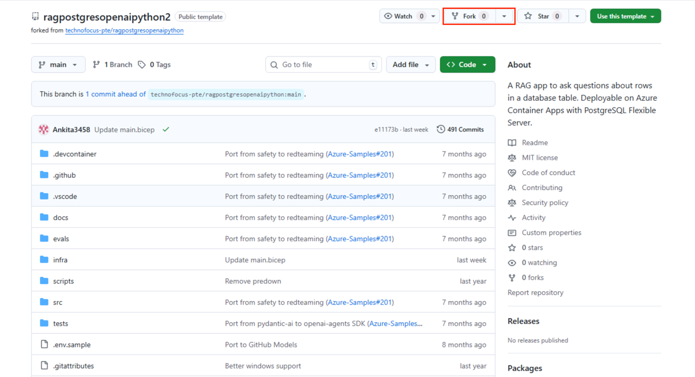

3.  Click on the **Create fork** button**.**

    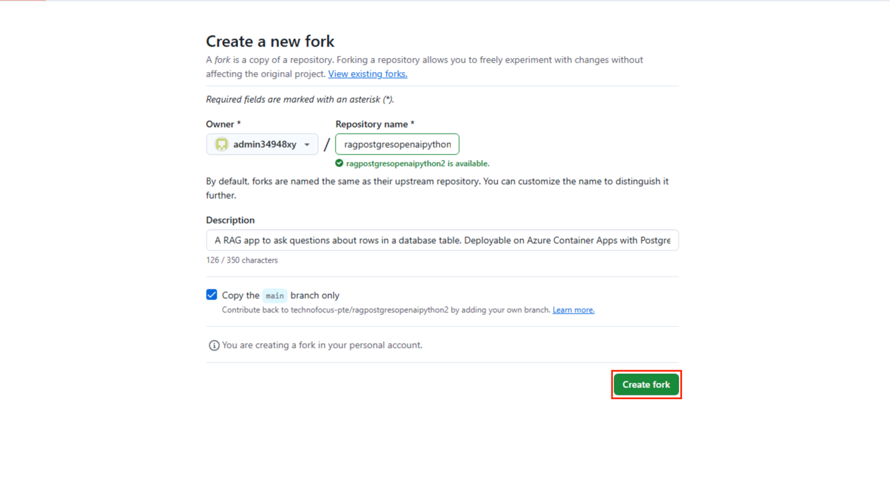

4.  Click on **Code** \> **Codespaces** \> **plus icon(+)** to open a
    new codespace.

    

5.  Wait for the codespace environment to set up. It takes a few minutes
    to set up completely.
    
    

    

## Task 3: Provision Services and deploy application to Azure

1.  Sign in to Azure with the Azure Developer CLI. Run the following
    command in the codespace’s terminal:

    +++azd auth login+++

    

    **Note:** When you paste a command in the codespace’s terminal, a pop-up
    will appear stating “See text and images copied to the clipboard”. Click
    **Allow** to access the clipboard.

2.  Copy the code and press **Enter**.

    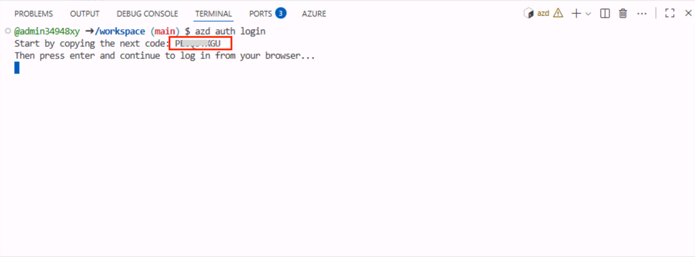

3.  A new window will open. Enter the verification code, then click
    **Next** to continue.

    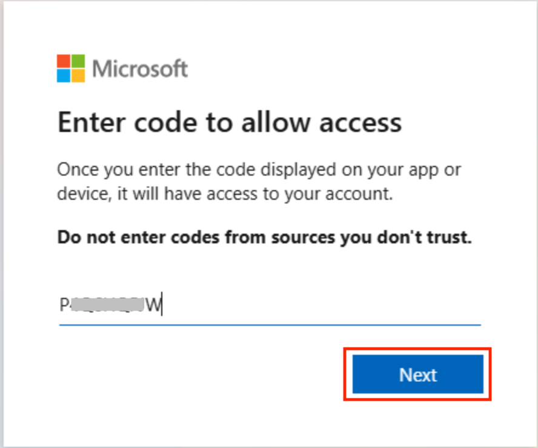

4.  Select your Azure account.

    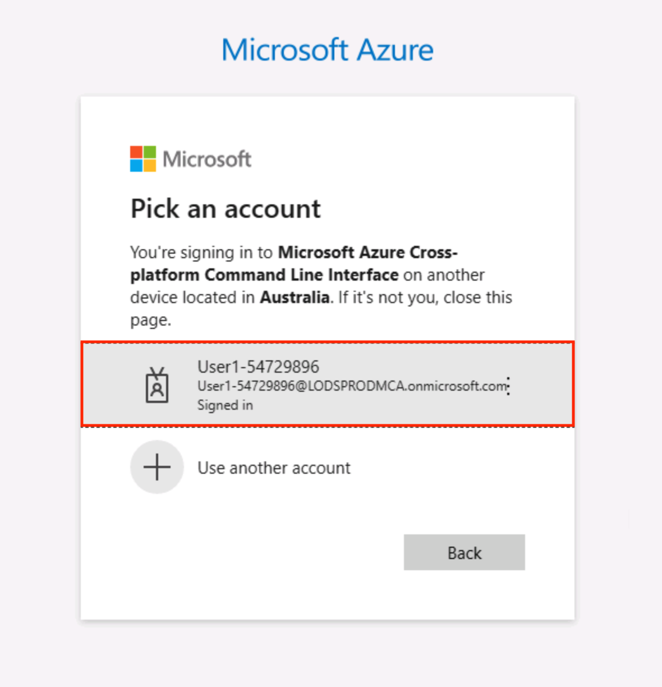

5.  Click on **Continue** button. 

    

    

6.  Switch back to the GitHub Codespace tab.

    

7.  To create an environment for Azure resources, run the following
    Azure Developer CLI command.

    +++azd env new+++

    It asks you to enter the environment name. So, enter the following name
    and then press **Enter**.

    **New Environment Name:** +++ragpgpyXXXXX++++ (XXXXX can be a unique
    number)

    **Note:** When creating an environment, ensure that the name consists of
    lowercase letters.

    

8.  Run the following Azure Developer CLI command to provision the Azure
    resources.

    +++azd env set AZURE_RESOURCE_GROUP ResourceGroup1+++

9.  Run the following Azure Developer CLI command to provision the Azure
    resources and deploy the code.

    +++azd up+++

    

10. When prompted, select a **subscription** to create the resources and
    select the region closest to your location; in this lab, we have
    chosen the
    **@lab.CloudResourceGroup(ResourceGroup1).Location** region.

    

11. When prompted, **enter a value for the ‘openAILocation’
    infrastructure parameter,** select the region closest to your
    location; in this lab, we have chosen the **North Central US**
    region

    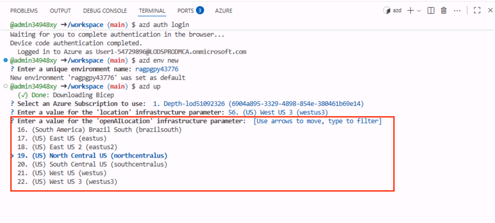

12. Wait for the deployment to complete; it might take around 19-20
    minutes.

    

13. While the deployment is in progress, you can open the link provided
    to begin verifying the deployed resources. This link directs you to
    the deployment page in the Azure Portal.

    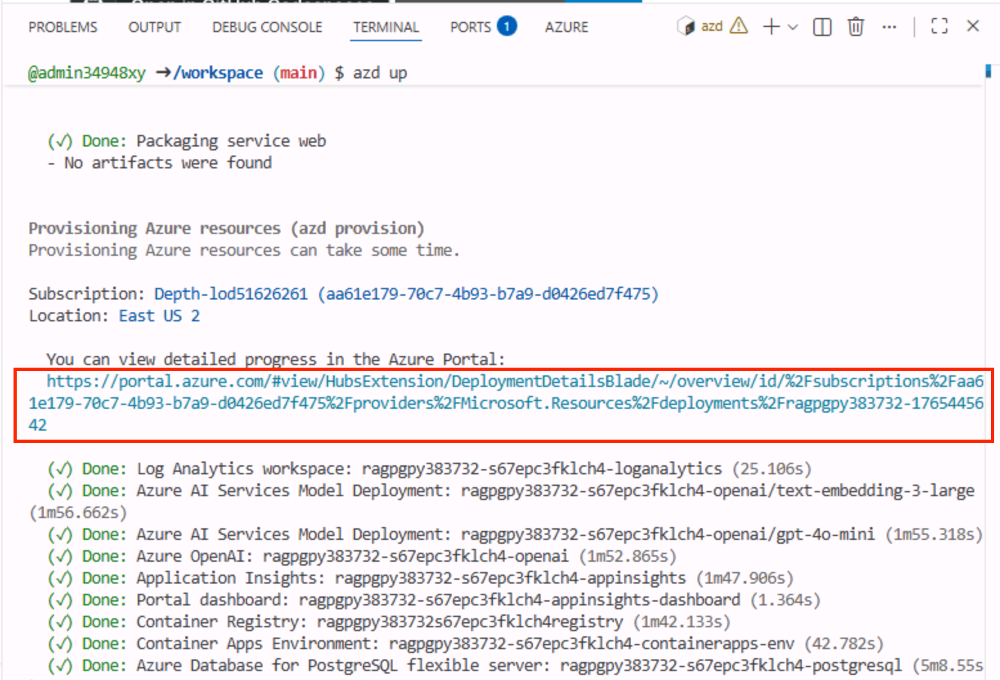

    

14. Navigate back to Codesapce. After completing the deployment
    successfully. Click on the deployed web app endpoint link. Then
    click on **Open** to open the web-app.

    

    

## Task 4: Use a chat app to get answers from files

1.  In the **RAG on database |OpenAI+PoastgreSQL** web app page, **click
    on “Best shoe for hiking?”** button and observe the output

    

    

2.  Click on the **clear chat.**

    

3.  In the **RAG on database |OpenAI+PoastgreSQL** web app page, click
    on **Climbing gear cheaper than $30** button and observe the output.

    

    

4.  Click on the **clear chat.**

## Task 5: Verify deployed resources in the Azure portal

1.  Navigate to the Azure portal and on the Home page, click on
    **Resource Groups**.

    

2.  Click on your resource group name.

    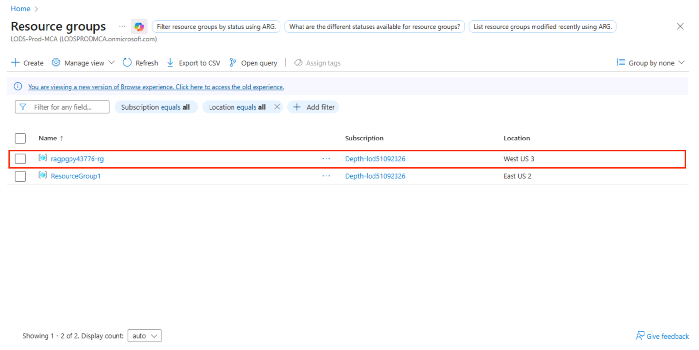

3.  Make sure the below resource got deployed successfully

    - Container App

    - Application Insights

    - Container Apps Environment

    - Log Analytics workspace

    - Azure OpenAI

    - Azure Database for PostgreSQL flexible server

    - Container registry

    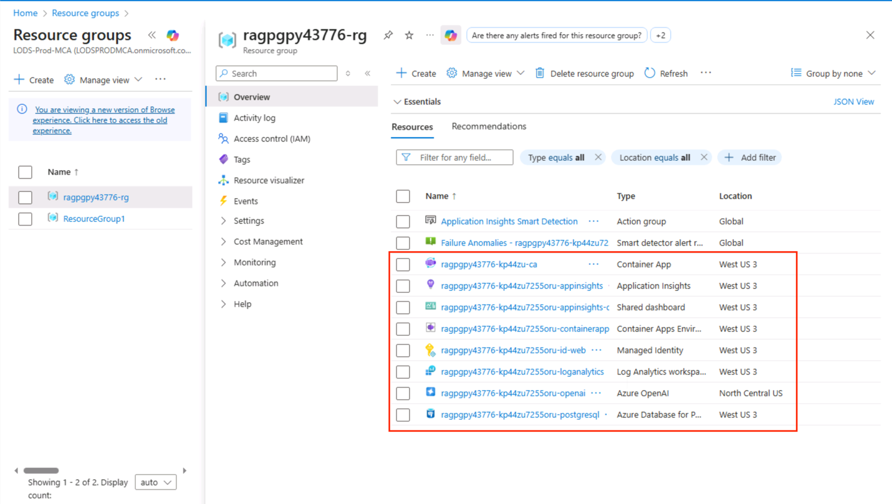

4.  Click on **Azure OpenAI** resource name.

    

5.  In the left navigation menu, under **Overview,** click **Go to
    Foundry portal**.

    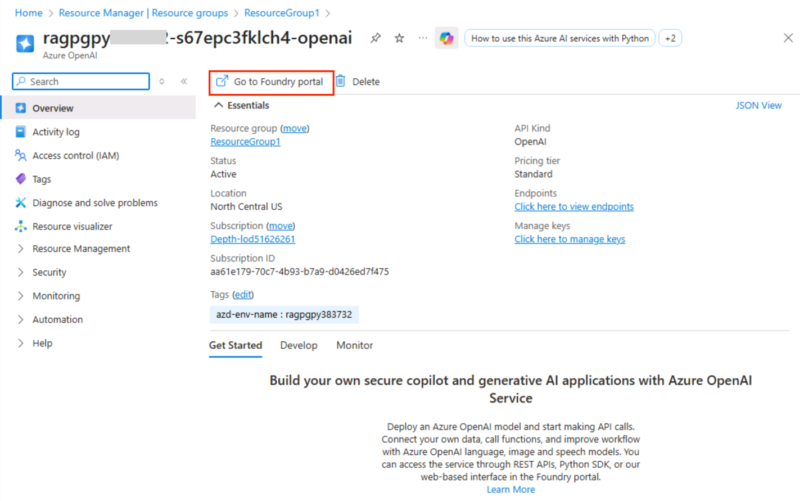

6.  Click on **Deployments** from the left navigation menu and make sure
    **gpt-4o-mini** and **text-embedding-3-large** should be deployed
    successfully.

    

## Task 6: Clean up all the resources

In this task, you will clean up all the created resources.

1.  Navigate back to the codespace terminal and run the following
    command:

    +++azd down --purge++

    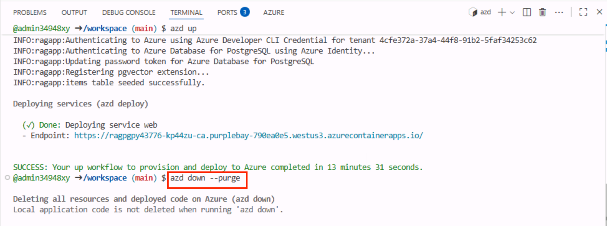

2.  When asked if you are sure you want to continue, enter +++**Y+++.**

    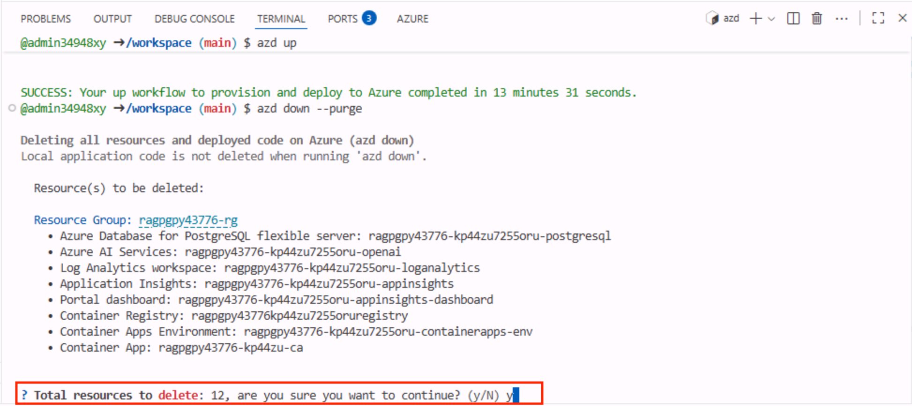

    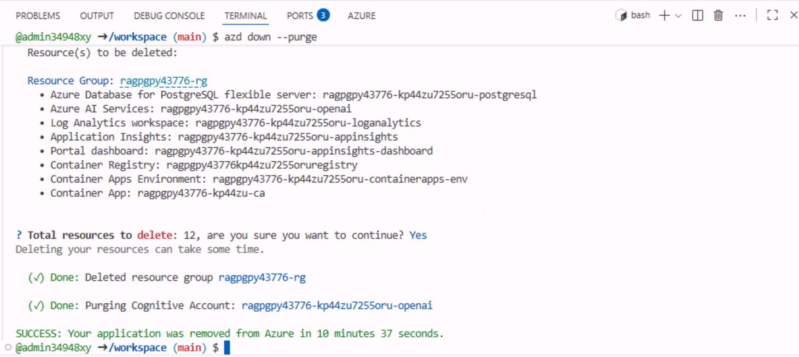

3.  If you get a prompt like ”Would you like to permanently delete these
    resources instead, allowing their names to be reused?”, then enter
    **Y**.

    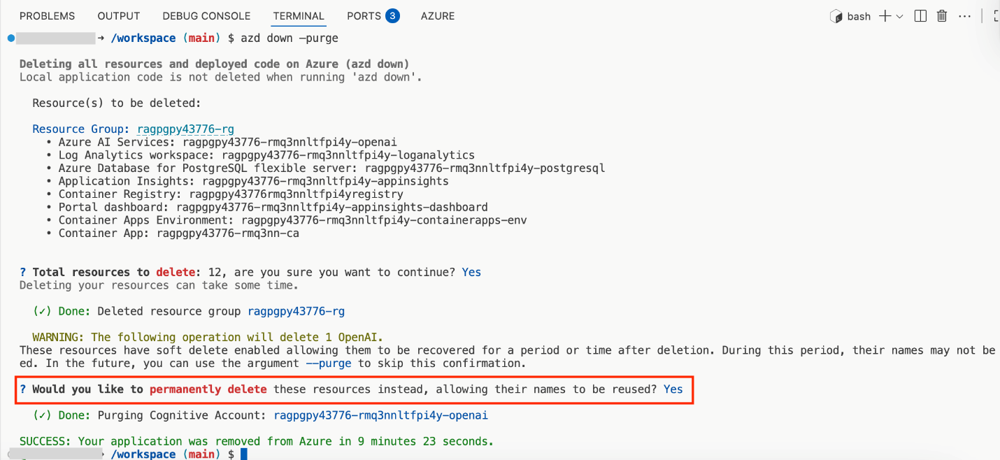

## Summary

This lab walks you through deploying a chat application with PostgreSQL
and OpenAI on Azure, focusing on cloud-based application deployment and
management. You’ve set up the development environment, installed
necessary tools like Azure CLI, configured Azure resources using Azure
Developer CLI, and deployed the application to Azure Container Apps.
